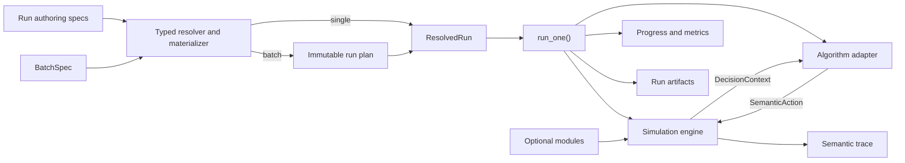

# Historical matrix architecture

This records the implementation before ADR 0017, at source `92ac906404406b1331beffebd0c42e0a4739ffc1`. It is not the current runtime API or a claim of grid support. For current behavior see [architecture](architecture.md). Historical acceptance remains bound to its recorded commits.

Status: The static serial, multi-mode core and the five-file single-run
configuration/generation/evidence slice are implemented and validated. Static JSP
adds intentional waiting, exact schedule replay, SPT, and optional PyJobShop/CP-SAT.
Static FJSP adds multiple modes, traditional `.fjs` import and an independent
seeded FJSP generator. Online arrivals add independent timing, reveal-aware
observations and explicit event waiting. Processing uncertainty supplies an
independent realized-duration plan with nominal-only online observations. Machine
outages support pause/resume; fixed-matrix AGVs support complete input-to-output
flow, queue rerouting and full execution replay. Optional finite buffers add exclusive
reservations, loaded waiting and blocking; direct Transfer supplies logistics without
AGV. Configurable quality-speed tables and independent operation draws add final
inspection, with public/hidden probability views. Study execution and a shared AGV
holding buffer are implemented; frozen IDETC acceptance uses those existing interfaces.
The shared learning projection and optional Gymnasium episode interface support
RLlib PPO and SB3 MaskablePPO training; checkpoint inference uses ordinary
run/study execution. Fixed-budget acceptance is separate from performance claims.

## Factory design authoring

The optional [Studio editor](studio.md) adds a separate `FactoryDesign` authoring
model and strict `smartsom.factory/v2` YAML. Pure domain/config data and geometry
feed a Qt scene; no simulator state or learning framework is involved. Browse
is the default. Explicit Edit gestures and grouped property drafts produce
validated immutable candidates, applied through a per-document undo stack.
`studio.editing` contains Qt-independent transformations; `commands` publishes
snapshots, `interaction` owns map gestures, and `editor` coordinates drafts and
document lifecycle. `persistence` owns local template records/recovery and
`export` renders an isolated scene. These do not add fields to factory truth.
The bundled four-machine Template 1 is the default; Template 2 preserves the
eight-machine layout. Both are complete v2 documents with explicit port bindings.
The factory-level operation-type catalog is authoritative for machine capability
references. Portable `authoring.operation_catalog_mode` is separate editor metadata
in the same v2 file; complete-file I/O preserves it through undo/save/recovery.
See [ADR 0016](decisions/0016-factory-operation-catalog.md).
Executable `FactorySpec`, v1 files and existing runtime contracts are unchanged.
See [ADR 0014](decisions/0014-studio-factory-design.md) for the boundary,
[ADR 0015](decisions/0015-studio-static-editor.md) for authoring lifecycle, and
[factory design](factory-design.md) for fields and spatial rules.

## Goals

SmartSOM will grow from a deterministic static FJSP core into a dynamic
manufacturing scheduling research platform. Its architecture must support new
events, resources, feasibility rules, objectives, algorithms, and experiment
scales without coupling simulator truth to one solver or learning framework.

The design follows four rules:

1. Keep the semantic core thin.
2. Compose behavior instead of building deep inheritance trees.
3. Introduce an abstraction with the first real use case, not as an empty
   placeholder.
4. Keep persisted experiment evidence separate from human-readable logging.

## Execution Flow

The single-run path supports static inputs and online policies with arrivals
processing-time uncertainty, machine outages, fixed-matrix transport and finite buffers;
the CP adapter remains static-only. Gym episodes call the same semantic step
interface; training orchestration and checkpoint inference have separate evidence.



Manual and batch execution must converge on the same `run_one()` path. A batch
runner may resolve, schedule, and aggregate child runs, but it must not contain
a second simulator or algorithm execution path.

`ResolvedRun` is the experiment runner's input, not an engine dependency. The
runner constructs the engine from validated, materialized domain inputs and
connects its selected algorithm separately. Factory resources belong to
`FactorySpec`; orders and their jobs belong to `WorkloadInstance`. Neither the
engine nor the workload owns algorithm configuration or output settings.

## Planned Package Ownership

Packages are created only when their first behavior is implemented and tested.

| Package | Responsibility |
| --- | --- |
| `domain` | Problem specifications, stable IDs, runtime state, and result types. |
| `engine` | Simulation clock, event queue, deterministic state transitions. |
| `dispatch` | Ready sets, semantic actions, candidates, and feasibility views. |
| `modules` | Composable event, resource/capability, and constraint contracts. |
| `algorithms` | Online policy, offline solver, and learning boundaries. |
| `learning` | Reveal-bound projection, Gym episodes, explicit optional backends and checkpoint policies. |
| `config` | Strict authoring envelopes, reference resolution, seeds, immutable resolved inputs. |
| `workloads` | Materialize workload profiles into domain instances before simulation. |
| `experiments` | Typed run/batch specifications, execution, and artifact lifecycle. |
| `trace` | Structured semantic records and deterministic replay. |
| `telemetry` | Human progress, debug logs, and optional external sinks. |
| `metrics` | Algorithm-independent performance and system measurements. |
| `adapters` | Optional Gymnasium, PettingZoo, Ray, solver, and tracking bridges. |

The intended dependency direction is inward: `domain` has no project-package
dependencies; `engine` depends on domain contracts and composes the concrete
arrival module; algorithms consume decision projections and return actions;
experiments compose these parts. The core never imports experiment
runners or optional frameworks.

## Semantic Simulation Contract

The action contract is `Dispatch(operation_id, processing_mode_id) | Transport(agv_id, job_id, destination) | Transfer(job_id, destination) | WaitUntil(until) | WaitNextEvent()`.
Simulator validity must not depend on candidate ordering or a transient array
slot. A processing mode identifies its required machine and other capabilities,
so two modes that use the same machine remain distinct. Further worker assignment or energy decisions should be represented as
separate staged semantic decisions rather than one monolithic joint tuple.

The default lifecycle will be an event-driven hybrid semi-Markov decision
process:

1. Commit a decision when one is required.
2. Schedule resulting future events.
3. Advance directly to the next event time when no decision is available.
4. Process same-time events in a deterministic phase order.
5. Rebuild the semantic action view.
6. Expose the next decision context and write trace records.

Fixed time steps may later exist as a projection or debugging mode, but they do
not define canonical simulator time.

### Implemented static core

The implementation supports static jobs with one serial operation
chain per job, a nonempty mode collection per operation, positive integer durations,
capacity-one machines, and no policy-controlled preemption. Machine outages
can interrupt processing under the automatic pause/resume contract below. Explicit predecessor IDs
define the chain; collection positions do not. Operation IDs are unique across
the workload, while mode IDs are local to their operation. Modes on the same
machine remain distinct even if their durations are equal. Input collection order
does not choose a mode or determine the serial route.

`OperationState.processing_mode_id` is empty while pending, set at dispatch and
retained through completion. Feasibility enumerates every currently legal
operation/mode pair in semantic-ID order. Selecting a mode starts the whole
operation and invalidates all its alternatives. Only the selected machine is
occupied; state, pending completion, actual interval and duration must all agree
with that selected mode. The original single-mode schedules and traces are
unchanged; adding alternatives changes the legal candidates in decision records.

The implemented Python API is:

```text
Simulator(factory, workload, *, arrivals=None, decision_trigger="dispatch_available", processing_times=None, machine_events=None, transport_enabled=False, buffers_enabled=False, holding_buffer_enabled=False, quality=None, quality_probability_visibility="public")
Simulator.current_decision -> DecisionContext | None
Simulator.step(SemanticAction) -> DecisionContext | SimulationResult
Simulator.run(OnlinePolicy) -> SimulationResult
OnlinePolicy.select_action(DecisionContext) -> SemanticAction
replay(factory, workload, actions, **same_input_options) -> SimulationResult
replay_schedule(factory, workload, schedule, **same_input_options) -> SimulationResult
```

The engine exclusively owns mutable runtime state. Domain inputs, decision
snapshots, and results are immutable. A decision exposes current operation and
machine state plus legal actions and their machine/duration information.
Reading `current_decision` has no side effects. `run()` and replay both use
`step()`; replay never implements a second transition system. Each episode uses
a new simulator. The initial online protocol belongs to `dispatch`; concrete
algorithm providers are added only with their first implemented behavior.

When legal dispatches remain, the clock stays at the current tick. Otherwise,
the engine advances directly to the next completion time, processes all
completions in stable semantic-ID order, and then exposes a decision.
`WaitUntil(until)` requires a strict integer greater than the current tick. It
advances to the target or an earlier completion, processes all same-tick events,
and returns when dispatch choices exist; otherwise automatic advancement applies.
Waiting is allowed without future events when dispatches exist. The action has
no persistent commitment after returning. `current_decision` still exposes a
finite set of legal dispatches; the arrival-event trigger below can additionally
return an empty set. Waiting has a separate legality rule.

`engine.schedule` validates complete semantic intervals, then converts the
schedule into actions using `ScheduleReplayPolicy`. Standalone replay and the
runner share this conversion and its final interval/makespan verification. Every
clock and state change goes through `step()`; idle time is never compressed.

Invalid actions fail before mutation. Deadlock, replay-length errors, and actions
after termination fail explicitly. Every transition checks runtime invariants;
completion records establish makespan with both logistics switches off; final output
deliveries/transfers establish it when AGV or buffer logistics are enabled. Canonical
traces contain decisions, dispatch/start, wait, completion, and termination, without
paths, wall-clock timestamps, or provider provenance.

This core slice uses standard-library types and hand-computable fixtures.
Configuration, import, generation, and persisted evidence live outside it.
Further dynamic modules and learning adapters remain later stages. Event
advancement and feasibility are separate responsibilities; generic hooks,
registries, and unimplemented module packages are not introduced in advance.

The [static core validation record](validation/static-core.md) documents its
tested behavior. The package table and wider execution flow remain architectural
direction; `domain`, `dispatch`, `engine`, `trace`, `config`, `workloads`,
`algorithms`, and `experiments` now have concrete static behavior.

### Implemented online arrivals

`ArrivalPlan` owns job timing independently of `WorkloadInstance`. Its entries
cover every job and enforce strict integer `0 <= reveal_at <= release_at`.
`ArrivalModule` provides immutable timing/visibility projections and positive-time
event inputs; the engine alone consumes events and mutates runtime state.
`scenario.arrivals` enables fixed JSONL input or `uniform_release_v1` generation;
there is no registry or second modules flag. Only generation consumes the existing
`demand` seed, with no draws for an all-initial profile.

`DecisionContext.jobs` includes the full chain, all modes and exact release time
of revealed jobs. Its operation-state collection excludes hidden jobs entirely;
legal candidates additionally require release. No hidden job count or next event
clock is exposed. Input files, solver requests and run artifacts are privileged
inputs/evidence and are never the online policy observation.

Same-tick phases are completion, breakdown, repair/automatic resume, pickup, delivery, reveal,
release, each ordered by semantic IDs;
all events settle before a decision. `dispatch_available` returns legal dispatch
choices only. `arrival_event` also returns once after reveal/release, even with
empty candidates; completion-only empty ticks still auto-advance. Zero-time facts
bootstrap without extra arrival trace. `WaitNextEvent()` explicitly advances to
the next event and applies these same trigger rules; no event means atomic failure.
SPT/first-feasible wait on empty candidates, while scripts must specify the wait.
`WaitUntil` can also be interrupted by an earlier arrival and has no persistent
commitment after a returned decision.

Schedule validation checks release times; action and schedule replay reuse the
same engine and accept the same plan/trigger. The CP provider rejects arrivals,
even all-zero plans; arrival-enabled scenarios require `decision_context`
visibility. Arrivals append positive-time reveal/release records and actual waits
to trace, and persist reusable `realized_events.jsonl` plus delivered
`observations.jsonl`. Manifest timing digests/provenance remain separate from
workload identity. See [ADR 0003](decisions/0003-online-arrival-timing-and-visibility.md)
and the [arrival validation record](validation/online-arrivals.md).

### Implemented processing-time uncertainty

`ProcessingTimePlan` is an immutable, complete operation-mode table whose nominal
values must match the workload. `ProcessingTimeModule` supplies a read-only
execution-duration lookup. Dispatch legality and online descriptions retain
nominal values; event scheduling, invariants and schedule validation use actual
values. After completion, `OperationState.actual_processing_ticks` exposes only
the chosen mode's net executed duration; its start-to-completion span can also
include machine downtime.
The public trace structure is unchanged, including exact unit-multiplier and
module-off equivalence.

`scenario.processing_time` selects a fixed reference or `uniform_multiplier`
profile, default 0.8–1.2, and is the only enabling declaration. The resolver
materializes it before simulator construction and directory allocation. A
versioned SHA-256 identity combines the existing `processing_time` seed with
operation/mode IDs; one local 53-bit draw per identity determines the multiplier.
Exact fractions implement decimal half-up rounding and minimum one tick. No
runtime sampling, shared RNG, workload mutation or generic hook registry is added.
Constant profiles and fixed imports do not draw randomness.

Complete actual tables, profiles and draw provenance are private evidence.
`realized_processing_times.json` is reusable; `observations.jsonl` records delivered
views whenever arrivals or uncertainty is enabled. Workload, arrival and processing
digests remain independent. Imported provenance preserves historical seeds without
rerunning their sampler. CP/full-static scenarios reject uncertainty, even when
actual happens to equal nominal. Arrivals compose through the existing engine
and observation writer. See the [processing-time acceptance record](validation/processing-times.md)
for the exact sampling recipe, fixed table schema and independent tests.

### Implemented machine breakdown and repair

`MachineOutagePlan` normalizes finite integer `[start,end)` intervals per machine,
merging overlap and adjacency. `scenario.machine_events` selects fixed input or
`exponential_uptime_v1` generation. Each participating machine has explicit mean
uptime and repair bounds, with an exclusive failure-start cutoff. Uptime includes
idle time and restarts after repair; ongoing repairs extend beyond the cutoff.
Only the existing `machine_events` seed is used, through per-machine versioned
SHA-256 identities and local RNGs before simulation.

`MachineEventModule` provides immutable events and per-machine interval/prefix
indexes. The engine owns the independent down-machine set and occupants, private
accumulated work and active segment starts. A fault pauses an occupied operation,
retaining its first start/mode/machine and cancelling its old completion. Repair
resumes remaining work automatically on the original machine. Cancelled heap
entries cannot advance time or appear as live completions. Invariants reconcile
progress with uptime, occupancy, semantic identity and the materialized events.

Completion precedes breakdown, then repair/automatic resume, pickup, delivery, reveal and release;
policies only see settled ticks. Tick-zero outages precede the first decision.
Existing dispatch-available and arrival-event triggers and wait semantics remain.
A down machine has no dispatch candidates even if idle. The policy view adds
`MachineState.availability` and paused operation status, never a repair forecast.
`actual_processing_ticks` is null until completion, then available in subsequent
decisions; other true processing requirements and remaining work stay private.

Action and schedule replay accept the same plan and use the existing step loop.
Schedule spans include pauses and reserve the machine throughout; actual active
segments are reconstructed from dispatch/pause/resume/completion records. Exact
validation checks net processing and immediate continuation, not just elapsed
span. Arbitrary intermediate waiting, migration, restart and rework are unsupported.

`realized_machine_events.json` keeps reusable input/provenance separate from the
arrival-only `realized_events.jsonl` and actual processing table. All actual event
records remain in one trace. Resolver materialization, provider binding and
`RunEvidence` retain their separate responsibilities; the new input is not a
second runtime state owner or module registry. CP/full-static rejects enabled
outages, including empty plans. Fixed-break PyJobShop and constrained DynaSchedBench
checks are independent validation tools. See [ADR 0005](decisions/0005-machine-outages-and-processing-progress.md)
and the [acceptance record](validation/machine-events.md).

### Implemented fixed-matrix transport

`FactorySpec.transport` owns immutable resources and the complete directed matrix.
`scenario.transport` enables the module before runtime. `TransportModule` supplies
read-only indexes/feasibility; engine-owned `TransportExecution` manages locations,
bindings and vehicle phases using the simulator's existing clock and event calendar.
There is no second loop/state machine. With buffers disabled, machines release
completed jobs immediately into unlimited postbuffers. Processing pauses retain
the original machine position. Enabled capacity behavior is described below.

`Transport` binds job/AGV/destination at booking, followed by empty travel, pickup,
loaded travel and delivery. `Dispatch` chooses the mode only from an unbound job
in the selected machine's prebuffer. Eligible prebuffer rerouting is legal; a
same-machine successor still requires AGV service from postbuffer to prebuffer.
Transport-only candidates can trigger decisions. Current public AGV/position views
respect arrival visibility and retain future-outage/actual-duration hiding.

The automatic baselines process first, then minimize empty-plus-loaded travel with
semantic ties. Queue reroutes are considered only from busy/down to idle/up machines;
this is a policy filter rather than an engine constraint. Algorithm parameters record
`transport_rule: shortest_trip` and `rerouting_rule: idle_destination`. Fixed logistics
uses no random draws or new seed domain. The CP provider rejects enabled transport.

`ExecutionSchedule` adds sequenced `ScheduledTransport` records to processing
intervals. Validation checks job and vehicle position chains and every timestamp;
replay waits for all recorded inbound occurrences before processing, including
same-tick intermediate visits. All actual actions go through shared `step()` and
all records/makespan are checked afterward. End-to-end makespan is final output
delivery. Module-off schedule/actions/trace stay unchanged; a zero matrix with
transport enabled still records all transport actions/events. See
[ADR 0006](decisions/0006-fixed-matrix-transport-and-execution-replay.md) and
[acceptance](validation/transport.md).

### Implemented finite buffers and blocking

`FactorySpec.buffers` provides immutable per-machine pre/post capacities;
`scenario.buffers: {kind: limited}` independently enables the rules. Zero, positive
integer and missing/null represent absent, finite and infinite waiting space.
Processing positions are separate. Fixed capacity consumes no seed. With AGV off,
`Transfer` introduces explicit instantaneous logistics using the same engine-owned
positions and source/destination checks. It cannot create pending movement.

`BufferModule` is a pure capacity/occupancy/reservation lookup. The existing
`TransportExecution` handles both movement modes: exclusive positive-prebuffer
booking reservations, arrived FIFO unreserved vehicles, zero-prebuffer unloading
onto idle/up processing positions, and postbuffer blocking/automatic handoff.
Completed jobs keep completed status and net processing time while holding a
machine; a separate `MachineHolding` phase describes occupancy. Actual pickup
frees the source, and booked holders never migrate before pickup. Repair affects
processing/paused work, not pending or completed machine occupants.

After the existing calendar phases, handoffs reach a stable state before decisions.
This closure neither changes the clock nor selects processing. Buffer snapshots
expose capacity, occupancy and reservation ownership. Active AGV trips expose
calculable arrival, not unknown unloading. All future-event and actual-work hiding
remains. Baselines use the explicit `immediate_capacity` admission filter; physical
legality is broader. Deadlock includes blocked positions, waiting vehicles and
capacity/reservation diagnostics; no automatic recovery exists.

Finite/direct logistics require v2 `ExecutionSchedule`: operations, trips, arrivals,
instantaneous transfers and explicit submission tick/sequence for every non-wait
action. `engine.execution_schedule` validates and follows that order through the
shared step loop; final verification compares every timestamp and output makespan.
Unlimited AGV retains v1/full-trace compatibility. CP rejects explicit buffer
enablement. See [ADR 0007](decisions/0007-finite-buffers-and-blocking.md) and
[acceptance](validation/buffers.md) for exact queue, blocking and replay rules.

### Quality-speed modes and final inspection

`FactorySpec.quality_speed` holds shared defaults and whole per-machine replacement
mode tables. The scenario enables generated or fixed draws and sets probability
visibility. Base workload and UPT inputs remain unchanged. `prepare_quality` creates
an immutable `QualityPlan` of draws and complete semantic execution modes;
`QualityModule` checks it against the base inputs and projects execution workload
and durations. Both engine and schedule validation use this same projection.

`Simulator`, action replay and schedule replay accept `quality=None` and
`quality_probability_visibility="public"` by default. Semantic Dispatch is unchanged;
full mode identities explicitly map to a base mode and quality label. Nominal and
actual durations are separately scaled with exact half-up/min-one rounding, after
base UPT materialization. Outage, transport and blocked intervals are unaffected.

`QualityExecution` is an engine-owned state component, with no clock or step loop.
It consumes each operation's realized draw once at processing completion, records
sticky job defect and inspects at actual output, including unload closure. With
logistics disabled inspection is at the final operation completion. Quality never
reroutes, cancels work, adds actions or creates decision notifications.

`DecisionContext.quality_modes` and `job_quality` are immutable reveal-filtered
views. Mode probabilities default public and become null in hidden mode. Draws,
per-operation outcomes and pre-output cumulative defects are always private.
Post-output views disclose only job inspection results. Full true outcomes remain
in audit trace and completed `SimulationResult.quality`.

A quality seed is appended only when enabled using existing seed/v1 derivation;
operation-local SHA-256 identities produce shared-across-mode 53-bit draws. Generation
lives outside the kernel. `realized_quality.json` is reusable independently of the
factory mode table; `effective_modes.json` records actual resolved execution inputs.
Physical input digests exclude visibility settings. Base-instance and base-UPT
exports are never replaced by scaled inputs, preventing double scaling on import.

SPT/first-feasible optionally fix one label and validate support on all base
candidates. Otherwise SPT uses scaled nominal work. CP rejects enabled quality;
there is no quality objective, new dependency or learning adapter.
See [ADR 0008](decisions/0008-quality-speed-and-final-inspection.md) and the
[acceptance record](validation/quality-speed.md).

## Extension Taxonomy

The word "constraint" does not cover every future extension:

- Online job arrival and machine breakdown/repair are event modules.
- Buffers, transporters, and energy systems are resource/capability modules.
- Capacity, compatibility, and energy limits are feasibility constraints.

Modules may contribute only through declared contracts such as event handling,
state extensions, candidate filtering, transition consequences, observations,
or metrics. The simulator remains the sole owner of canonical state changes.

## Algorithm Boundaries

These interfaces are implemented:

```text
OnlinePolicy.select_action(DecisionContext) -> SemanticAction
SolverAdapter.solve(SolveRequest) -> ScheduleSolution
run_one(ResolvedRun) -> RunResult
resolve_study(path) -> ResolvedStudy
run_batch(ResolvedStudy) -> BatchResult
```

Dispatching rules and online heuristics implement `OnlinePolicy`. Full-
information CP, MILP, planning, or genetic algorithms implement
`SolverAdapter`. A rolling-horizon solver is exposed through an online adapter
that declares its information assumptions. A learned policy uses the same
online interface, while training belongs to an optional `Learner` boundary.
Resource MARL now has an explicit decision-group contract in ADR 0012:
ResourceProjection reads only public state, JointActionCoordinator freezes and
arbitrates proposals, and the optional SmartSOMParallelEnv adapts episode protocol.
The coordinator calls the unchanged step API and never writes physical state.
Joint proposal records remain separate from core trace. RLlib training and
checkpoint evaluation are a separate implementation checkpoint.

Built-in algorithms implement these interfaces directly. Optional framework
integrations live in shared adapters selected through stable provider IDs. A
configuration does not define an adapter or contain an absolute Python import
path. Adapters translate decision projections and results, but the simulator
remains the sole owner of canonical state.

The current immutable `SolveRequest` contains validated factory/workload inputs,
makespan objective, solver time budget, and effective solver seed. Its input is
full static information; the resolver enforces this visibility contract before
the runner constructs the request. `ScheduleSolution` contains semantic
intervals, status, objective, bound, and runtime. External indices exist only in
`algorithms.pyjobshop`, with explicit ID mappings. `ResolvedRun` contains normalized
specifications, materialized input references and digests, effective seeds,
provider identity, objective, budget, and output policy. These execution types
are distinct from user-authored `RunSpec` files that may still contain
references.

## Configuration Contracts

Human-authored configuration uses composable YAML files; materialized
instances and event streams use JSON or JSONL. All are validated into typed
models:

- `FactorySpec`: static resources, capabilities, calendars, buffers, and any
  available layout or travel-time representation.
- `WorkloadProfile`: job, order, and demand generation assumptions.
- `WorkloadInstance`: the fully materialized hierarchy described by
  `Order -> Job -> Operation -> ProcessingMode`. Each mode owns its required
  resources and nominal duration.
- `ScenarioSpec`: factory plus exactly one workload source, enabled dynamic
  modules or a fixed event set, maximum information visibility, horizon, and
  termination.
- `AlgorithmSpec`: stable provider ID, interface kind, parameters, required
  information scope, and optional checkpoint.
- `RunSpec`: one scenario plus one algorithm, objective, budget, root seed,
  telemetry policy, and output root.
- `BatchSpec`: replications, algorithm comparisons, typed parameter sweeps,
  batch root seed, concurrency, resume, and failure policy.

A normal run references five reusable files: a factory, a workload profile or
materialized instance, a scenario, an algorithm, and a run. The user invokes
the run file; the typed resolver follows references and persists the fully
resolved result. Dynamic declarations stay in the scenario, so static
experiments do not need an empty event file. A scenario may instead reference a
materialized event set for exact replay.

Every value has one authoritative owner. Generator matrices are import or
generation inputs rather than a second runtime representation. Generators run
before simulation, and the engine consumes only a validated materialized
instance and realized event stream. Online workloads distinguish physical
`release_at` from observable `reveal_at`. Established benchmark encodings such
as `.fjs` are translated into `WorkloadInstance` at this same ingress boundary.

Numeric seeds are owned by `RunSpec` or, when expanding a study, `BatchSpec`.
For a study, the versioned derivation keys a world root by the study seed,
explicit base case ID and replication index. Workload, demand, machine
events, and processing-time noise derive from that root; algorithm and solver
seeds additionally include the algorithm-variant identity. Each world is
materialized once, and paired algorithms reference identical instance and event
digests. Deterministic same-time event ordering is an engine invariant, not a
seed domain.

For module ablations, the shared base case and replication identify the
unchanged inputs; disabling one module must not reseed the workload or other
modules. Only declared changed components may have different content digests.
Structural factory/workload changes form separate base cases. This refines the
batch parameter-cell rule for ablations without changing standalone seed/v1;
see [ADR 0004](decisions/0004-paired-ablation-inputs.md). The implemented study
subset is specified in [ADR 0009](decisions/0009-paired-studies-and-recovery.md).

Scenario visibility is the maximum environment information available. An
algorithm declares what it requires, and resolution rejects an incompatible
pair before execution. The manifest records the resulting information
projection as evidence rather than acting as another configuration authority.

The CLI supports these execution entry points:

```text
smartsom validate CONFIG
smartsom plan CONFIG
smartsom run RUN_CONFIG
smartsom batch BATCH_CONFIG
```

Planning is read-only: it shows resolved references, effective seeds, child-run
count, and sweep differences without simulating. Scientific grids live in
`StudySpec`, the implemented subset of `BatchSpec`. Workers are operational and
recorded in study progress. Dimensions use stable ID order and Cartesian expansion;
zip expansion and arbitrary parameter grids are not implemented. Each child has a
stable plan-entry identity used with resolved input digests for resume.

Pydantic and PyYAML support the implemented file-authoring boundary; the core
still imports neither. Every run persists its fully resolved
configuration so referenced source files are not required for later auditing.

### Implemented single-run subset

`resolve_run(path) -> ResolvedRun` reads each input once, validates strict versioned
envelopes and cross references, derives seeds, and materializes the workload in
memory. References are relative to their containing files. `ResolvedRun` is an
immutable snapshot with embedded inputs, original source-byte digests, canonical
domain digests, effective seeds, and generation or import provenance. `run_one()` does not
reread those files. `validate RUN_CONFIG`, `run RUN_CONFIG`, and the separate
`import-fjs INPUT --instance-id ID --output-dir DIR` command are implemented.
CP adds the run-owned solver time budget. `plan STUDY` and `batch STUDY` now
expand explicit Cartesian studies. General budget/parameter overrides remain future work.

The `static_jsp_v1` generator samples serial routes without repeated machines and
positive integer nominal durations before simulation. The `workload` seed is
consumed for generation and the `solver` seed for CP; other domains stay inactive. An
imported instance retains historical provenance without consuming any current
world seed. These generators retain nominal durations; the separate processing-time
module materializes uncertainty without modifying workload content.

`static_fjsp_v1` uses an independent profile with an eligible-machine count range.
Each operation samples its candidate machines without replacement; different
operations may revisit a machine, and a job may have more operations than machines.
One mode per sampled machine receives an independently drawn integer duration.
The draw order is job operation count, then per operation candidate count,
candidate sample, and durations in selected machine-ID order. Both generators
use local RNGs; the existing `static_jsp_v1` recipe remains unchanged. Their
profiles are strictly matched to the generator name without a registry.

The standard-library `workloads.fjs` importer accepts only traditional serial
FJSP, validates the full source, and returns immutable `ImportedProblem` inputs.
One nonempty line describes one job; machine indices are 1-based. Alternative
IDs encode machine, duration and identical-pair occurrence, preserving duplicates
and making alternative reordering semantically equivalent. The optional third
header token is retained as metadata. Import provenance records the raw-byte
digest, importer version, explicit instance ID and header; it is distinct from
generation provenance. Exported instances retain that history. Domain digests
sort mode IDs as well as entity IDs and exclude all provenance and paths.

`builtin.scripted` submits semantic actions and checks for unused script actions
at termination. `builtin.first_feasible` selects the smallest legal semantic ID
pair. `builtin.spt` selects by `(nominal_ticks, operation_id, processing_mode_id)`.
All three consume only the existing decision context. The runner constructs a
fresh policy and simulator for each attempt, invokes public `step()`, and drains
the read-only trace after every step, including rejected actions. No generic
provider registry, dynamic import, module hook, or separate batch state machine
is implemented.

`pyjobshop.cp_sat` declares `interface_kind: offline_solver` and
`required_information: full_static`; both fields are explicit. The scenario must
permit `visibility: full_static`. Online providers still receive only the current
decision context even in that scenario. CP accepts empty algorithm parameters,
one fixed worker, and the positive finite `run.budget.solver_time_limit_seconds`
(default 60 seconds). Online providers reject this budget. The versioned named
solver seed is unchanged; CP-SAT receives `solver_seed % 2**31`, and evidence
records both values. The adapter creates one mandatory task per operation and
maps every mode explicitly between external indices and semantic IDs. The horizon
guard sums the longest candidate duration per operation and rejects totals above
PyJobShop's supported `2**42`, rather than truncating ticks.

After solving, the runner saves the solution before creating its replay policy.
Both online and offline paths then use the same step/trace loop. Solver status
and exact replay are separate checks: a `FEASIBLE` incumbent may succeed but is
not labeled proven optimal. Fixed input plus fixed actions/schedule yields exact
replay; different solver versions or time-limited searches need not return the
same schedule. The [static JSP record](validation/static-jsp.md) documents this slice.
The [static FJSP record](validation/static-fjsp.md) adds official-example/Mk01
acceptance and input contracts. CP runtime/difficulty classification remains
deferred; raw solver metrics are retained.

The supported fields, v1 serialization and seed recipe, examples, and checks are
documented in [configured-run validation](validation/configured-runs.md).

The complete ownership and execution decision is recorded in
[`0002 — Experiment Configuration and Execution Contract`](decisions/0002-experiment-configuration-and-execution.md).

## Run Evidence and Logging

Local run artifacts are authoritative. External systems such as W&B may later
mirror metrics and artifacts, but they cannot replace the local replay record.

```text
runs/<run_id>/
  resolved_run.yaml
  manifest.json
  realized_instance.json  # after materialization
  solver_result.json     # after an offline solve returns, before replay
  realized_events.jsonl  # arrival inputs, when enabled
  realized_machine_events.json  # machine outages, when enabled
  realized_processing_times.json  # actual processing times, when enabled
  realized_quality.json  # independent operation draws, when enabled
  effective_modes.json  # resolved quality modes and execution durations
  execution_schedule.json  # successful logistics run: processing, trips and/or transfers
  observations.jsonl    # delivered views, when dynamic input, logistics or quality are enabled
  progress.log
  trace.jsonl        # after simulation starts
  metrics.jsonl      # after simulation starts
  summary.json
  debug.log        # opt-in; 10 MiB, two backups
  failure.json      # present on failure
```

A run directory is allocated only after authoring, cross-reference validation,
and workload materialization succeed. From that point, `resolved_run.yaml`,
`manifest.json`, `progress.log`, and `summary.json` are retained for every attempt; the manifest
is finalized with status and all available digests. Later-stage artifacts are
required only if their producing stage is reached.

Internal preparation now separates file/reference handling in `resolve_run()`
from typed workload, arrival, processing-time and machine-event materializers. The materializers
consume parsed inputs and explicit effective seeds, without algorithm or output
settings. Algorithm compatibility and budget binding are centralized separately
from explicit provider construction. `ResolvedRun` retains its existing public fields and adds optional
module-specific materialized inputs, digests and provenance.

`RunEvidence` owns the existing attempt files, trace cursor and counters derived
from records. It never advances a simulator or changes its state. `run_one()`
still coordinates initialization, solving, schedule validation, the shared step
loop and finalization. The writer receives immutable trace suffixes through
`Simulator.trace_since(cursor)`; full in-memory traces and all invariants remain.
Artifact hashing reads bounded chunks rather than whole files. There is no
generic provider/module registry or telemetry plugin framework.

- `progress.log` records line-buffered lifecycle/step progress; the CLI
  also reports live stage/count/elapsed progress and the successful run directory.
- `trace.jsonl` records semantic events, decisions, actions, and transitions
  required for replay without storing full state snapshots by default.
- `metrics.jsonl` stores structured time-series values for analysis and future
  tracking sinks. This slice emits cumulative completed-operation counts and a
  terminal makespan only for successful runs.
- `debug.log` provides opt-in bounded stage/cursor diagnostics, separate from
  semantic trace and observations. CLI progress reports stages and actual counts.
- `manifest.json` binds resolved configuration, Git identity, environment,
  seeds, information assumptions, and artifact digests.
- `realized_instance.json` is the canonical base workload, whether imported or
  generated. Quality-enabled execution derives a separate mode catalog from it;
  the reusable base instance never contains already-scaled quality expansions.
- `realized_processing_times.json` records all actual mode durations and optional
  sampling provenance; it is a private input, never a policy observation.
- `observations.jsonl` records public snapshots delivered to online policies when
  arrivals, processing uncertainty, machine outages, transport or buffers are active.
- `realized_events.jsonl` records reusable arrival timing when arrivals are enabled.
- `realized_machine_events.json` records independent canonical machine outages and
  optional generation provenance. These input files are privileged evidence,
  not the policy observation or a mixed event stream.
- `execution_schedule.json` stores the complete processing/movement timetable on
  successful logistics runs. The manifest records transport/buffer enablement,
  capacities, admission rule and input digests. Finite/direct logistics use v2.
- `summary.json` records terminal metrics, status, and end reason; logistics runs
  also distinguish processing completion time from final output-delivery makespan.
  Their progress log reports both completed operations and delivered jobs.
- `solver_result.json` records the semantic schedule, solver status, objective,
  bound, gap, runtime, budget, worker count and both solver seeds. Missing or
  non-finite solver measurements use JSON null. No-incumbent results and replay
  failures cannot produce a successful makespan; available solver output and
  partial trace are retained with failure evidence.
- `failure.json` preserves structured failure information; failed runs are not
  silently dropped from a batch.

A study stores an immutable `plan.json`, embedded child `snapshots/`, source
manifest, progress, JSON/CSV/Markdown summaries, and retained attempts. Each
child remains independently runnable and auditable through the same
`run_one()` contract.

Generated run content is excluded from Git unless an explicitly approved small
fixture or example is required for tests or documentation.

## Dependency Policy

The base package must remain lightweight. The optional `cp` extra pins PyJobShop
0.0.9 and OR-Tools 9.12.4544; they are imported only inside the adapter's solve
method. Base CI exercises SPT and reference replay without that extra; CP CI
requires real official FJSP example, Mk01 and ft06 optimality/replay acceptance.
Neither import nor generation requires the solver extra. The optional `gym` extra
pins Gymnasium 1.2.2. `learning.projection` remains standard-library-only;
`learning.gymnasium` imports Gym and NumPy explicitly. `learning-rllib` pins Ray
2.58.0 and Torch 2.14.0; `learning-sb3` pins SB3/Contrib 2.9.0 and Torch 2.14.0.
Both use Gym 1.2.2. Framework imports occur only in the selected backend.
Importing `smartsom`, configuration or the shared projection does not import those
frameworks. `pettingzoo` pins PettingZoo 1.27.0 for the resource Parallel API;
`learning-marl` combines it with the same locked Ray/Gym/Torch versions. Tracking
dependencies are supplied by the optional TensorBoard and W&B adapters. See
[ADR 0011](decisions/0011-centralized-learning-projection-and-episodes.md).

### Centralized training and checkpoint evaluation

The following v1 contract remains the frozen item 12/13 execution path.
The public usability API adds the lifecycle described below; its update checkpoints
do not change these historical inference artifacts.

`resolve_training_run()` returns an immutable `ResolvedTrainingRun`. Its shared
input preparation freezes factory/workload once, then rematerializes only enabled
generated disturbances for each scientific episode index. Fixed imports retain
their content and provenance. The framework's RNG uses a separate derived seed;
switching backend cannot change the input for the same episode index. The ordinary
run/study seed recipes and goldens are unchanged.

`train_one()` coordinates the selected explicit backend, common Gym adapter and
training evidence. It does not implement physics. The adapter uses public
`DecisionContext`, reveal-bound slots, an engine-derived physical action mask and
the same semantic `step()`. Reward and failed/truncated episode limits are defined
in ADR 0011. Failed legal exploration retains evidence and starts the next
episode; invalid actions or nonfinite learner values abort the attempt.

Algorithm configuration owns provider, projection, network/PPO parameters and an
optional checkpoint reference. The training run owns sample budget, episode limits,
root seed and output. `train` rejects checkpoint input; `run`/study require an
existing checkpoint for learning providers and never start training. The checkpoint
manifest binds provider/version, fixed projection, base structure/module identity,
parameters, dependency versions, file digests and changed weight digests. Capacity,
compatibility and file checks precede Simulator or evaluation directory creation.

Checkpoint inference implements `OnlinePolicy`; the runner's existing shared step
loop owns execution and `RunEvidence` retains its usual observations, trace,
metrics and full schedule. Inference does not recreate a framework environment or
alter simulator constraints. An algorithm preset can be reused on another case;
a checkpoint currently requires the same base structure and compatible projection.

Training attempts store a resolved input snapshot, compact episode ledger,
learner metrics, progress, optional bounded debug files and a checkpoint bundle.
The ledger records scientific seeds/input identities, slot bindings, semantic
actions, rewards and observation/mask/trace digests; failed episodes also retain
full traces. The final partially sampled episode is explicitly recorded without
inventing completion or a terminal penalty. `audit_training()` reconstructs these
episodes without original authoring files, verifies every step, and replays complete
schedules. Paired evaluation uses ordinary study world seeds, not training seeds.

Both backends run one CPU environment, with one numerical thread. Checkpoints are
inference exports, not a training-resume interface. Ray's fixed-version log-directory
and parameter-count metric adaptations are isolated in its backend and do not
change the projection, episode input, PPO budget or simulator.

### Resource-agent training and evaluation

Implementation status: the resource interface and training/evaluation extension
are implemented. Clean integrated commit `469c45f` passed fresh fixed-budget
training and all ten paired evaluations/replays on macOS. The original failures
remain retained; the authorized learner-unit adjustment changes optimization
units only. Linux/h20 remains a separate Week3 validation task. The ordinary
centralized backends also passed the completion regression independently.
The resource acceptance script defaults to a clean integrated source commit;
training, every evaluation and the final audit must share that identity.
Explicit development checks use the same frozen recipe and replay requirements
but cannot establish formal completion. Platform qualification remains explicit.

`ResourceProjection` consumes the public context and known factory resources;
it never reads hidden instance/event state. Reveal-bound jobs, resource IDs and
current semantic candidate mappings form the three observation groups defined in
[ADR 0012](decisions/0012-resource-agents-and-joint-proposals.md). Machines and AGVs
have separate shared PPO networks. No centralized critic or learned arbitrator is
introduced. Without AGVs, machines own the existing legal Transfer actions.

`JointActionCoordinator` decodes a complete joint dictionary before execution,
orders processing then movement, rejects repeated job claims and rechecks current
legality. Its `next_action/accept_outcome` pair feeds the runner's existing step
loop and its `execute` convenience method feeds PettingZoo and joint replay.
It owns proposals only; the core retains sole ownership of physics and time.
All-NOOP uses one public-witness WaitNextEvent or reports policy_stalled.

`rllib.resource_ppo` uses the existing training resolver, episode seed sequence
and `train_one`; only the RLlib protocol and role modules differ. Space discovery
does not reset a scientific episode. `run_one` loads both role modules through an
OnlinePolicy facade and records every joint proposal/NOOP/rejection separately in
`joint_decisions.jsonl`. Core observations are still recorded before every actual
core action. Joint and physical decision counts are not interchangeable.

Resource checkpoints bind role mapping, changed role parameters, projection and
coordination versions, normalized base structure, dependencies and member digests.
`replay_joint` is framework-free; it compares the entire joint ledger, including
candidate and observation hashes, physical trace ranges and the single shared
team return. A final training-budget prefix includes the next revealed observation
bindings, without inventing another decision or completion. Successful episodes
also undergo action and exact schedule replay. Base imports require no learning
framework; this remains an inference checkpoint contract, not resumable training.

Resource PPO parameters include `learner_reward_scale` (default 1 for existing
files). The fixed micro preset uses 0.0001. Only copied learner reward tensors are
scaled, before GAE computes both advantages and value targets; raw simulator,
ParallelEnv, evaluation and replay rewards stay in tick units. The scale is saved
in resolved configuration and checkpoint parameters; centralized providers do not
accept it. This avoids the observed saturation of Ray's squared value-loss clamp
without changing the physical objective, NOOP or coordination contract.

### Public experiment authoring and training lifecycle

`smartsom.api` is the common entry point for CLI and short Python scripts.
`ExperimentConfig` is mutable and typed; `prepare()` validates it, resolves paths,
materializes input and freezes a detached snapshot. Parameter origins are stored
separately from scientific identity. The existing `ResolvedRun` and
`ResolvedTrainingRun` boundaries still feed the ordinary engine and PPO backends.
The v2 recipe supersedes former CLI parameter restrictions in [ADR 0013](decisions/0013-experiment-usability-and-training-lifecycle.md).

Each experiment owns one authoritative directory and records its stage/attempt
directories in `run.json`. `TrainingDisplay` consumes progress events and preserves
learner RNGs while producing local structured metrics, Rich output and optional
TensorBoard/W&B streams. Optional tracking imports occur only when selected.

The opt-in training coordinator saves after complete PPO updates. An update holds
framework state, adaptive PPO variables, optimizer state, RNGs, counters and active
environment action prefixes. Reconstruction verifies the environment before
continuation without learning or counting the prefix twice. `last` and `best`
refer to the same immutable update entity when appropriate. Independent weights
initialization resets training state; old inference-only artifacts remain usable.
Budget completion is separate from interruption, early stopping and pruning.

Fixed validation has separate input identities and random state. Best selection
does not compare survivor means across different completion sets. Independent
evaluation selects models explicitly, materializes paired worlds once and audits
both completed schedules and legitimate failure prefixes. Catalogs and shortcuts
are rebuildable views; portable bundles copy real bytes and retain original
references through a bundle relocation map.

Multi-environment sampling, extension and search work is tracked separately in
[the implementation record](implementation-usability.md). Their configured scope
does not establish platform acceptance before the real integration checks pass.

### Study execution and evidence

`resolve_study` materializes each case/replication once before algorithm binding.
`run_batch` runs ordinary `run_one` calls in bounded spawn processes, retaining
all attempts and validating inputs/source/evidence before reusing successes.
See ADR 0009 for seed origins, first/second Ctrl+C, restart and lock contracts.
Study observations default to `observation_hashes.jsonl`; `full` retains the
existing `observations.jsonl` meaning. Hash recording saves file volume but still
serializes observations; it does not imply bounded trace memory or faster stepping.

### Shared holding resource

Factory `holding_buffer` and scenario `{kind: shared}` add one optional AGV-only
waiting resource, independent of machine pre/post limits. The existing logistics
component handles reservations, actual source pickup, waiting/unload closure and
v2 action timing. Holding reservations carry buffer IDs, not counterfeit machine
IDs. `DecisionContext.holding_buffer` exposes only current capacity/occupancy;
off-state serialization omits the new field. SPT considers holding only as a
safe-capacity fallback when that job has no safe eligible machine destination.
See [ADR 0010](decisions/0010-shared-holding-buffer.md). No new clock, random domain,
state writer, solver or no-AGV movement interface is introduced.
