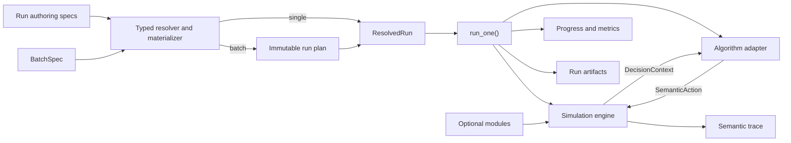

# SmartSOM Architecture

Status: The static serial, multi-mode core and the five-file single-run
configuration/generation/evidence slice are implemented and validated. Static JSP
adds intentional waiting, exact schedule replay, SPT, and optional PyJobShop/CP-SAT.
Static FJSP adds multiple modes, traditional `.fjs` import and an independent
seeded FJSP generator. Online arrivals add independent timing, reveal-aware
observations and explicit event waiting. Processing uncertainty supplies an
independent realized-duration plan with nominal-only online observations. Batch,
other dynamic modules, and learning remain planned.

## Goals

SmartSOM will grow from a deterministic static FJSP core into a dynamic
manufacturing scheduling research platform. Its architecture must support new
events, resources, feasibility rules, objectives, algorithms, and experiment
scales without coupling simulator truth to one solver or learning framework.

The design follows four rules:

1. Keep the semantic core thin.
2. Compose behavior instead of building deep inheritance trees.
3. Introduce an abstraction with the first real use case, not as an empty
   placeholder.
4. Keep persisted experiment evidence separate from human-readable logging.

## Execution Flow

The single-run path supports static inputs and online policies with arrivals
and/or processing-time uncertainty;
the CP adapter remains static-only. Batch, further modules and learning adapters
remain planned.



Manual and batch execution must converge on the same `run_one()` path. A batch
runner may resolve, schedule, and aggregate child runs, but it must not contain
a second simulator or algorithm execution path.

`ResolvedRun` is the experiment runner's input, not an engine dependency. The
runner constructs the engine from validated, materialized domain inputs and
connects its selected algorithm separately. Factory resources belong to
`FactorySpec`; orders and their jobs belong to `WorkloadInstance`. Neither the
engine nor the workload owns algorithm configuration or output settings.

## Planned Package Ownership

Packages are created only when their first behavior is implemented and tested.

| Package | Responsibility |
| --- | --- |
| `domain` | Problem specifications, stable IDs, runtime state, and result types. |
| `engine` | Simulation clock, event queue, deterministic state transitions. |
| `dispatch` | Ready sets, semantic actions, candidates, and feasibility views. |
| `modules` | Composable event, resource/capability, and constraint contracts. |
| `algorithms` | Online policy, offline solver, and learning boundaries. |
| `config` | Strict authoring envelopes, reference resolution, seeds, immutable resolved inputs. |
| `workloads` | Materialize workload profiles into domain instances before simulation. |
| `experiments` | Typed run/batch specifications, execution, and artifact lifecycle. |
| `trace` | Structured semantic records and deterministic replay. |
| `telemetry` | Human progress, debug logs, and optional external sinks. |
| `metrics` | Algorithm-independent performance and system measurements. |
| `adapters` | Optional Gymnasium, PettingZoo, Ray, solver, and tracking bridges. |

The intended dependency direction is inward: `domain` has no project-package
dependencies; `engine` depends on domain contracts and composes the concrete
arrival module; algorithms consume decision projections and return actions;
experiments compose these parts. The core never imports experiment
runners or optional frameworks.

## Semantic Simulation Contract

The action contract is `Dispatch(operation_id, processing_mode_id) | WaitUntil(until) | WaitNextEvent()`.
Simulator validity must not depend on candidate ordering or a transient array
slot. A processing mode identifies its required machine and other capabilities,
so two modes that use the same machine remain distinct. Future transport,
buffer, worker assignment, or energy decisions should be represented as
separate staged semantic decisions rather than one monolithic joint tuple.

The default lifecycle will be an event-driven hybrid semi-Markov decision
process:

1. Commit a decision when one is required.
2. Schedule resulting future events.
3. Advance directly to the next event time when no decision is available.
4. Process same-time events in a deterministic phase order.
5. Rebuild the semantic action view.
6. Expose the next decision context and write trace records.

Fixed time steps may later exist as a projection or debugging mode, but they do
not define canonical simulator time.

### Implemented static core

The implementation supports static jobs with one serial operation
chain per job, a nonempty mode collection per operation, positive integer durations,
capacity-one machines, and no policy-controlled preemption. Machine outages
can interrupt processing under the automatic pause/resume contract below. Explicit predecessor IDs
define the chain; collection positions do not. Operation IDs are unique across
the workload, while mode IDs are local to their operation. Modes on the same
machine remain distinct even if their durations are equal. Input collection order
does not choose a mode or determine the serial route.

`OperationState.processing_mode_id` is empty while pending, set at dispatch and
retained through completion. Feasibility enumerates every currently legal
operation/mode pair in semantic-ID order. Selecting a mode starts the whole
operation and invalidates all its alternatives. Only the selected machine is
occupied; state, pending completion, actual interval and duration must all agree
with that selected mode. The original single-mode schedules and traces are
unchanged; adding alternatives changes the legal candidates in decision records.

The implemented Python API is:

```text
Simulator(factory, workload, *, arrivals=None, decision_trigger="dispatch_available", processing_times=None, machine_events=None)
Simulator.current_decision -> DecisionContext | None
Simulator.step(SemanticAction) -> DecisionContext | SimulationResult
Simulator.run(OnlinePolicy) -> SimulationResult
OnlinePolicy.select_action(DecisionContext) -> SemanticAction
replay(factory, workload, actions, *, arrivals=None, decision_trigger="dispatch_available", processing_times=None, machine_events=None) -> SimulationResult
replay_schedule(factory, workload, schedule, *, arrivals=None, decision_trigger="dispatch_available", processing_times=None, machine_events=None) -> SimulationResult
```

The engine exclusively owns mutable runtime state. Domain inputs, decision
snapshots, and results are immutable. A decision exposes current operation and
machine state plus legal actions and their machine/duration information.
Reading `current_decision` has no side effects. `run()` and replay both use
`step()`; replay never implements a second transition system. Each episode uses
a new simulator. The initial online protocol belongs to `dispatch`; concrete
algorithm providers are added only with their first implemented behavior.

When legal dispatches remain, the clock stays at the current tick. Otherwise,
the engine advances directly to the next completion time, processes all
completions in stable semantic-ID order, and then exposes a decision.
`WaitUntil(until)` requires a strict integer greater than the current tick. It
advances to the target or an earlier completion, processes all same-tick events,
and returns when dispatch choices exist; otherwise automatic advancement applies.
Waiting is allowed without future events when dispatches exist. The action has
no persistent commitment after returning. `current_decision` still exposes a
finite set of legal dispatches; the arrival-event trigger below can additionally
return an empty set. Waiting has a separate legality rule.

`engine.schedule` validates complete semantic intervals, then converts the
schedule into actions using `ScheduleReplayPolicy`. Standalone replay and the
runner share this conversion and its final interval/makespan verification. Every
clock and state change goes through `step()`; idle time is never compressed.

Invalid actions fail before mutation. Deadlock, replay-length errors, and actions
after termination fail explicitly. Every transition checks runtime invariants;
completion records independently establish the terminal makespan. Canonical
traces contain decisions, dispatch/start, wait, completion, and termination, without
paths, wall-clock timestamps, or provider provenance.

This core slice uses standard-library types and hand-computable fixtures.
Configuration, import, generation, and persisted evidence live outside it.
Further dynamic modules and learning adapters remain later stages. Event
advancement and feasibility are separate responsibilities; generic hooks,
registries, and unimplemented module packages are not introduced in advance.

The [static core validation record](validation/static-core.md) documents its
tested behavior. The package table and wider execution flow remain architectural
direction; `domain`, `dispatch`, `engine`, `trace`, `config`, `workloads`,
`algorithms`, and `experiments` now have concrete static behavior.

### Implemented online arrivals

`ArrivalPlan` owns job timing independently of `WorkloadInstance`. Its entries
cover every job and enforce strict integer `0 <= reveal_at <= release_at`.
`ArrivalModule` provides immutable timing/visibility projections and positive-time
event inputs; the engine alone consumes events and mutates runtime state.
`scenario.arrivals` enables fixed JSONL input or `uniform_release_v1` generation;
there is no registry or second modules flag. Only generation consumes the existing
`demand` seed, with no draws for an all-initial profile.

`DecisionContext.jobs` includes the full chain, all modes and exact release time
of revealed jobs. Its operation-state collection excludes hidden jobs entirely;
legal candidates additionally require release. No hidden job count or next event
clock is exposed. Input files, solver requests and run artifacts are privileged
inputs/evidence and are never the online policy observation.

Same-tick phases are completion, breakdown, repair/automatic resume, reveal,
release, each ordered by semantic IDs;
all events settle before a decision. `dispatch_available` returns legal dispatch
choices only. `arrival_event` also returns once after reveal/release, even with
empty candidates; completion-only empty ticks still auto-advance. Zero-time facts
bootstrap without extra arrival trace. `WaitNextEvent()` explicitly advances to
the next event and applies these same trigger rules; no event means atomic failure.
SPT/first-feasible wait on empty candidates, while scripts must specify the wait.
`WaitUntil` can also be interrupted by an earlier arrival and has no persistent
commitment after a returned decision.

Schedule validation checks release times; action and schedule replay reuse the
same engine and accept the same plan/trigger. The CP provider rejects arrivals,
even all-zero plans; arrival-enabled scenarios require `decision_context`
visibility. Arrivals append positive-time reveal/release records and actual waits
to trace, and persist reusable `realized_events.jsonl` plus delivered
`observations.jsonl`. Manifest timing digests/provenance remain separate from
workload identity. See [ADR 0003](decisions/0003-online-arrival-timing-and-visibility.md)
and the [arrival validation record](validation/online-arrivals.md).

### Implemented processing-time uncertainty

`ProcessingTimePlan` is an immutable, complete operation-mode table whose nominal
values must match the workload. `ProcessingTimeModule` supplies a read-only
execution-duration lookup. Dispatch legality and online descriptions retain
nominal values; event scheduling, invariants and schedule validation use actual
values. After completion, `OperationState.actual_processing_ticks` exposes only
the chosen mode's net executed duration; its start-to-completion span can also
include machine downtime.
The public trace structure is unchanged, including exact unit-multiplier and
module-off equivalence.

`scenario.processing_time` selects a fixed reference or `uniform_multiplier`
profile, default 0.8–1.2, and is the only enabling declaration. The resolver
materializes it before simulator construction and directory allocation. A
versioned SHA-256 identity combines the existing `processing_time` seed with
operation/mode IDs; one local 53-bit draw per identity determines the multiplier.
Exact fractions implement decimal half-up rounding and minimum one tick. No
runtime sampling, shared RNG, workload mutation or generic hook registry is added.
Constant profiles and fixed imports do not draw randomness.

Complete actual tables, profiles and draw provenance are private evidence.
`realized_processing_times.json` is reusable; `observations.jsonl` records delivered
views whenever arrivals or uncertainty is enabled. Workload, arrival and processing
digests remain independent. Imported provenance preserves historical seeds without
rerunning their sampler. CP/full-static scenarios reject uncertainty, even when
actual happens to equal nominal. Arrivals compose through the existing engine
and observation writer. See the [processing-time acceptance record](validation/processing-times.md)
for the exact sampling recipe, fixed table schema and independent tests.

### Implemented machine breakdown and repair

`MachineOutagePlan` normalizes finite integer `[start,end)` intervals per machine,
merging overlap and adjacency. `scenario.machine_events` selects fixed input or
`exponential_uptime_v1` generation. Each participating machine has explicit mean
uptime and repair bounds, with an exclusive failure-start cutoff. Uptime includes
idle time and restarts after repair; ongoing repairs extend beyond the cutoff.
Only the existing `machine_events` seed is used, through per-machine versioned
SHA-256 identities and local RNGs before simulation.

`MachineEventModule` provides immutable events and per-machine interval/prefix
indexes. The engine owns the independent down-machine set and occupants, private
accumulated work and active segment starts. A fault pauses an occupied operation,
retaining its first start/mode/machine and cancelling its old completion. Repair
resumes remaining work automatically on the original machine. Cancelled heap
entries cannot advance time or appear as live completions. Invariants reconcile
progress with uptime, occupancy, semantic identity and the materialized events.

Completion precedes breakdown, then repair/automatic resume, reveal and release;
policies only see settled ticks. Tick-zero outages precede the first decision.
Existing dispatch-available and arrival-event triggers and wait semantics remain.
A down machine has no dispatch candidates even if idle. The policy view adds
`MachineState.availability` and paused operation status, never a repair forecast.
`actual_processing_ticks` is null until completion, then available in subsequent
decisions; other true processing requirements and remaining work stay private.

Action and schedule replay accept the same plan and use the existing step loop.
Schedule spans include pauses and reserve the machine throughout; actual active
segments are reconstructed from dispatch/pause/resume/completion records. Exact
validation checks net processing and immediate continuation, not just elapsed
span. Arbitrary intermediate waiting, migration, restart and rework are unsupported.

`realized_machine_events.json` keeps reusable input/provenance separate from the
arrival-only `realized_events.jsonl` and actual processing table. All actual event
records remain in one trace. Resolver materialization, provider binding and
`RunEvidence` retain their separate responsibilities; the new input is not a
second runtime state owner or module registry. CP/full-static rejects enabled
outages, including empty plans. Fixed-break PyJobShop and constrained DynaSchedBench
checks are independent validation tools. See [ADR 0005](decisions/0005-machine-outages-and-processing-progress.md)
and the [acceptance record](validation/machine-events.md).

## Extension Taxonomy

The word "constraint" does not cover every future extension:

- Online job arrival and machine breakdown/repair are event modules.
- Buffers, transporters, and energy systems are resource/capability modules.
- Capacity, compatibility, and energy limits are feasibility constraints.

Modules may contribute only through declared contracts such as event handling,
state extensions, candidate filtering, transition consequences, observations,
or metrics. The simulator remains the sole owner of canonical state changes.

## Algorithm Boundaries

The first three interfaces below are implemented; batch remains planned:

```text
OnlinePolicy.select_action(DecisionContext) -> SemanticAction
SolverAdapter.solve(SolveRequest) -> ScheduleSolution
run_one(ResolvedRun) -> RunResult
run_batch(BatchSpec) -> BatchResult
```

Dispatching rules and online heuristics implement `OnlinePolicy`. Full-
information CP, MILP, planning, or genetic algorithms implement
`SolverAdapter`. A rolling-horizon solver is exposed through an online adapter
that declares its information assumptions. A learned policy uses the same
online interface, while training belongs to an optional `Learner` boundary.
MARL waits for an explicit decision-group contract.

Built-in algorithms implement these interfaces directly. Optional framework
integrations live in shared adapters selected through stable provider IDs. A
configuration does not define an adapter or contain an absolute Python import
path. Adapters translate decision projections and results, but the simulator
remains the sole owner of canonical state.

The current immutable `SolveRequest` contains validated factory/workload inputs,
makespan objective, solver time budget, and effective solver seed. Its input is
full static information; the resolver enforces this visibility contract before
the runner constructs the request. `ScheduleSolution` contains semantic
intervals, status, objective, bound, and runtime. External indices exist only in
`algorithms.pyjobshop`, with explicit ID mappings. `ResolvedRun` contains normalized
specifications, materialized input references and digests, effective seeds,
provider identity, objective, budget, and output policy. These execution types
are distinct from user-authored `RunSpec` files that may still contain
references.

## Configuration Contracts

Human-authored configuration uses composable YAML files; materialized
instances and event streams use JSON or JSONL. All are validated into typed
models:

- `FactorySpec`: static resources, capabilities, calendars, buffers, and any
  available layout or travel-time representation.
- `WorkloadProfile`: job, order, and demand generation assumptions.
- `WorkloadInstance`: the fully materialized hierarchy described by
  `Order -> Job -> Operation -> ProcessingMode`. Each mode owns its required
  resources and nominal duration.
- `ScenarioSpec`: factory plus exactly one workload source, enabled dynamic
  modules or a fixed event set, maximum information visibility, horizon, and
  termination.
- `AlgorithmSpec`: stable provider ID, interface kind, parameters, required
  information scope, and optional checkpoint.
- `RunSpec`: one scenario plus one algorithm, objective, budget, root seed,
  telemetry policy, and output root.
- `BatchSpec`: replications, algorithm comparisons, typed parameter sweeps,
  batch root seed, concurrency, resume, and failure policy.

A normal run references five reusable files: a factory, a workload profile or
materialized instance, a scenario, an algorithm, and a run. The user invokes
the run file; the typed resolver follows references and persists the fully
resolved result. Dynamic declarations stay in the scenario, so static
experiments do not need an empty event file. A scenario may instead reference a
materialized event set for exact replay.

Every value has one authoritative owner. Generator matrices are import or
generation inputs rather than a second runtime representation. Generators run
before simulation, and the engine consumes only a validated materialized
instance and realized event stream. Online workloads distinguish physical
`release_at` from observable `reveal_at`. Established benchmark encodings such
as `.fjs` are translated into `WorkloadInstance` at this same ingress boundary.

Numeric seeds are owned by `RunSpec` or, when expanding a study, `BatchSpec`.
For a batch, a versioned stable derivation scheme first keys a world root by the
non-algorithm parameter cell and replication index. Workload, demand, machine
events, and processing-time noise derive from that root; algorithm and solver
seeds additionally include the algorithm-variant identity. Each world is
materialized once, and paired algorithms reference identical instance and event
digests. Deterministic same-time event ordering is an engine invariant, not a
seed domain.

For future module ablations, the shared base case and replication identify the
unchanged inputs; disabling one module must not reseed the workload or other
modules. Only declared changed components may have different content digests.
Structural factory/workload changes form separate base cases. This refines the
batch parameter-cell rule for ablations without changing standalone seed/v1;
see [ADR 0004](decisions/0004-paired-ablation-inputs.md). Batch execution remains
unimplemented.

Scenario visibility is the maximum environment information available. An
algorithm declares what it requires, and resolution rejects an incompatible
pair before execution. The manifest records the resulting information
projection as evidence rather than acting as another configuration authority.

The planned CLI has four entry points:

```text
smartsom validate CONFIG
smartsom plan CONFIG
smartsom run RUN_CONFIG
smartsom batch BATCH_CONFIG
```

Planning is read-only: it shows resolved references, effective seeds, child-run
count, and sweep differences without simulating. Scientific grids live in
`BatchSpec`; permitted operational CLI overrides must be recorded in resolved
configuration and the manifest. Batch dimensions use deterministic ordered
Cartesian expansion by default; zip expansion is explicit. Each child has a
stable plan-entry identity used with resolved input digests for resume.

Pydantic and PyYAML support the implemented file-authoring boundary; the core
still imports neither. Every run persists its fully resolved
configuration so referenced source files are not required for later auditing.

### Implemented single-run subset

`resolve_run(path) -> ResolvedRun` reads each input once, validates strict versioned
envelopes and cross references, derives seeds, and materializes the workload in
memory. References are relative to their containing files. `ResolvedRun` is an
immutable snapshot with embedded inputs, original source-byte digests, canonical
domain digests, effective seeds, and generation or import provenance. `run_one()` does not
reread those files. `validate RUN_CONFIG`, `run RUN_CONFIG`, and the separate
`import-fjs INPUT --instance-id ID --output-dir DIR` command are implemented.
CP adds the run-owned solver time budget; other budgets, overrides,
`plan`, and `batch` remain future work.

The `static_jsp_v1` generator samples serial routes without repeated machines and
positive integer nominal durations before simulation. The `workload` seed is
consumed for generation and the `solver` seed for CP; other domains stay inactive. An
imported instance retains historical provenance without consuming any current
world seed. These generators retain nominal durations; the separate processing-time
module materializes uncertainty without modifying workload content.

`static_fjsp_v1` uses an independent profile with an eligible-machine count range.
Each operation samples its candidate machines without replacement; different
operations may revisit a machine, and a job may have more operations than machines.
One mode per sampled machine receives an independently drawn integer duration.
The draw order is job operation count, then per operation candidate count,
candidate sample, and durations in selected machine-ID order. Both generators
use local RNGs; the existing `static_jsp_v1` recipe remains unchanged. Their
profiles are strictly matched to the generator name without a registry.

The standard-library `workloads.fjs` importer accepts only traditional serial
FJSP, validates the full source, and returns immutable `ImportedProblem` inputs.
One nonempty line describes one job; machine indices are 1-based. Alternative
IDs encode machine, duration and identical-pair occurrence, preserving duplicates
and making alternative reordering semantically equivalent. The optional third
header token is retained as metadata. Import provenance records the raw-byte
digest, importer version, explicit instance ID and header; it is distinct from
generation provenance. Exported instances retain that history. Domain digests
sort mode IDs as well as entity IDs and exclude all provenance and paths.

`builtin.scripted` submits semantic actions and checks for unused script actions
at termination. `builtin.first_feasible` selects the smallest legal semantic ID
pair. `builtin.spt` selects by `(nominal_ticks, operation_id, processing_mode_id)`.
All three consume only the existing decision context. The runner constructs a
fresh policy and simulator for each attempt, invokes public `step()`, and drains
the read-only trace after every step, including rejected actions. No generic
provider registry, dynamic import, module hook, or separate batch state machine
is implemented.

`pyjobshop.cp_sat` declares `interface_kind: offline_solver` and
`required_information: full_static`; both fields are explicit. The scenario must
permit `visibility: full_static`. Online providers still receive only the current
decision context even in that scenario. CP accepts empty algorithm parameters,
one fixed worker, and the positive finite `run.budget.solver_time_limit_seconds`
(default 60 seconds). Online providers reject this budget. The versioned named
solver seed is unchanged; CP-SAT receives `solver_seed % 2**31`, and evidence
records both values. The adapter creates one mandatory task per operation and
maps every mode explicitly between external indices and semantic IDs. The horizon
guard sums the longest candidate duration per operation and rejects totals above
PyJobShop's supported `2**42`, rather than truncating ticks.

After solving, the runner saves the solution before creating its replay policy.
Both online and offline paths then use the same step/trace loop. Solver status
and exact replay are separate checks: a `FEASIBLE` incumbent may succeed but is
not labeled proven optimal. Fixed input plus fixed actions/schedule yields exact
replay; different solver versions or time-limited searches need not return the
same schedule. The [static JSP record](validation/static-jsp.md) documents this slice.
The [static FJSP record](validation/static-fjsp.md) adds official-example/Mk01
acceptance and input contracts. CP runtime/difficulty classification remains
deferred; raw solver metrics are retained.

The supported fields, v1 serialization and seed recipe, examples, and checks are
documented in [configured-run validation](validation/configured-runs.md).

The complete ownership and execution decision is recorded in
[`0002 — Experiment Configuration and Execution Contract`](decisions/0002-experiment-configuration-and-execution.md).

## Run Evidence and Logging

Local run artifacts are authoritative. External systems such as W&B may later
mirror metrics and artifacts, but they cannot replace the local replay record.

```text
runs/<run_id>/
  resolved_run.yaml
  manifest.json
  realized_instance.json  # after materialization
  solver_result.json     # after an offline solve returns, before replay
  realized_events.jsonl  # arrival inputs, when enabled
  realized_machine_events.json  # machine outages, when enabled
  realized_processing_times.json  # actual processing times, when enabled
  observations.jsonl    # delivered views, when any dynamic input is enabled
  progress.log
  trace.jsonl        # after simulation starts
  metrics.jsonl      # after simulation starts
  summary.json
  debug.log        # optional
  failure.json      # present on failure
```

A run directory is allocated only after authoring, cross-reference validation,
and workload materialization succeed. From that point, `resolved_run.yaml`,
`manifest.json`, `progress.log`, and `summary.json` are retained for every attempt; the manifest
is finalized with status and all available digests. Later-stage artifacts are
required only if their producing stage is reached.

Internal preparation now separates file/reference handling in `resolve_run()`
from typed workload, arrival, processing-time and machine-event materializers. The materializers
consume parsed inputs and explicit effective seeds, without algorithm or output
settings. Algorithm compatibility and budget binding are centralized separately
from explicit provider construction. `ResolvedRun` retains its existing public fields and adds optional
module-specific materialized inputs, digests and provenance.

`RunEvidence` owns the existing attempt files, trace cursor and counters derived
from records. It never advances a simulator or changes its state. `run_one()`
still coordinates initialization, solving, schedule validation, the shared step
loop and finalization. The writer receives immutable trace suffixes through
`Simulator.trace_since(cursor)`; full in-memory traces and all invariants remain.
Artifact hashing reads bounded chunks rather than whole files. There is no
generic provider/module registry or telemetry plugin framework.

- `progress.log` records line-buffered lifecycle/step progress; the current CLI
  prints validation or terminal status and the successful run directory.
- `trace.jsonl` records semantic events, decisions, actions, and transitions
  required for replay without storing full state snapshots by default.
- `metrics.jsonl` stores structured time-series values for analysis and future
  tracking sinks. This slice emits cumulative completed-operation counts and a
  terminal makespan only for successful runs.
- `debug.log` is planned for opt-in internal diagnostics and exception stacks;
  it is not currently produced. Bounded debug output and live console progress
  remain future work, separate from semantic trace and observation recording.
- `manifest.json` binds resolved configuration, Git identity, environment,
  seeds, information assumptions, and artifact digests.
- `realized_instance.json` is the canonical materialized workload consumed by
  the engine, whether imported or generated.
- `realized_processing_times.json` records all actual mode durations and optional
  sampling provenance; it is a private input, never a policy observation.
- `observations.jsonl` records public snapshots delivered to online policies when
  arrivals, processing uncertainty or machine outages are active.
- `realized_events.jsonl` records reusable arrival timing when arrivals are enabled.
- `realized_machine_events.json` records independent canonical machine outages and
  optional generation provenance. These input files are privileged evidence,
  not the policy observation or a mixed event stream.
- `summary.json` records terminal metrics, status, and end reason.
- `solver_result.json` records the semantic schedule, solver status, objective,
  bound, gap, runtime, budget, worker count and both solver seeds. Missing or
  non-finite solver measurements use JSON null. No-incumbent results and replay
  failures cannot produce a successful makespan; available solver output and
  partial trace are retained with failure evidence.
- `failure.json` preserves structured failure information; failed runs are not
  silently dropped from a batch.

A batch stores `resolved_batch.yaml`, an immutable `run_plan.jsonl`, an
aggregate `batch_summary.json`, and one ordinary run directory per child. Each
child remains independently runnable and auditable through the same
`run_one()` contract.

Generated run content is excluded from Git unless an explicitly approved small
fixture or example is required for tests or documentation.

## Dependency Policy

The base package must remain lightweight. The optional `cp` extra pins PyJobShop
0.0.9 and OR-Tools 9.12.4544; they are imported only inside the adapter's solve
method. Base CI exercises SPT and reference replay without that extra; CP CI
requires real official FJSP example, Mk01 and ft06 optimality/replay acceptance.
Neither import nor generation requires the solver extra. Optional Gymnasium, learning,
MARL, and tracking dependencies will be introduced as separate extras with the
adapter that needs them. Importing `smartsom` must not import or require those
frameworks.
