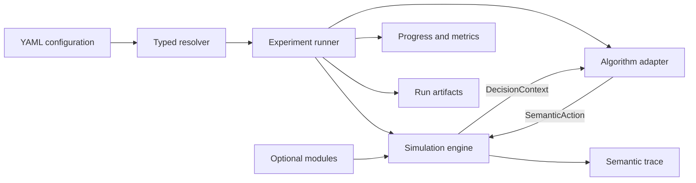

# SmartSOM Architecture

Status: Foundation contract; simulator behavior is not implemented.

## Goals

SmartSOM will grow from a deterministic static FJSP core into a dynamic
manufacturing scheduling research platform. Its architecture must support new
events, resources, feasibility rules, objectives, algorithms, and experiment
scales without coupling simulator truth to one solver or learning framework.

The design follows four rules:

1. Keep the semantic core thin.
2. Compose behavior instead of building deep inheritance trees.
3. Introduce an abstraction with the first real use case, not as an empty
   placeholder.
4. Keep persisted experiment evidence separate from human-readable logging.

## Planned Execution Flow



Manual and batch execution must converge on the same `run_one()` path. A batch
runner may resolve, schedule, and aggregate child runs, but it must not contain
a second simulator or algorithm execution path.

## Planned Package Ownership

Packages are created only when their first behavior is implemented and tested.

| Package | Responsibility |
| --- | --- |
| `domain` | Problem specifications, stable IDs, runtime state, and result types. |
| `engine` | Simulation clock, event queue, deterministic state transitions. |
| `dispatch` | Ready sets, semantic actions, candidates, and feasibility views. |
| `modules` | Composable event, resource/capability, and constraint contracts. |
| `algorithms` | Online policy, offline solver, and learning boundaries. |
| `experiments` | Typed run/batch specifications, execution, and artifact lifecycle. |
| `trace` | Structured semantic records and deterministic replay. |
| `telemetry` | Human progress, debug logs, and optional external sinks. |
| `metrics` | Algorithm-independent performance and system measurements. |
| `adapters` | Optional Gymnasium, PettingZoo, Ray, solver, and tracking bridges. |

The intended dependency direction is inward: `domain` has no project-package
dependencies; `engine` depends on domain contracts; modules implement explicit
engine extension points; algorithms consume decision projections and return
actions; experiments compose these parts. The core never imports experiment
runners or optional frameworks.

## Semantic Simulation Contract

The first action contract will be `Dispatch(operation_id, machine_id)`.
Simulator validity must not depend on candidate ordering or a transient array
slot. Future transport, buffer, or energy decisions should be represented as
separate staged semantic decisions rather than one monolithic joint tuple.

The default lifecycle will be an event-driven hybrid semi-Markov decision
process:

1. Commit a decision when one is required.
2. Schedule resulting future events.
3. Advance directly to the next event time when no decision is available.
4. Process same-time events in a deterministic phase order.
5. Rebuild the semantic action view.
6. Expose the next decision context and write trace records.

Fixed time steps may later exist as a projection or debugging mode, but they do
not define canonical simulator time.

## Extension Taxonomy

The word "constraint" does not cover every future extension:

- Online job arrival and machine breakdown/repair are event modules.
- Buffers, transporters, and energy systems are resource/capability modules.
- Capacity, compatibility, and energy limits are feasibility constraints.

Modules may contribute only through declared contracts such as event handling,
state extensions, candidate filtering, transition consequences, observations,
or metrics. The simulator remains the sole owner of canonical state changes.

## Algorithm Boundaries

The planned minimum interfaces are:

```text
OnlinePolicy.select_action(DecisionContext) -> SemanticAction
SolverAdapter.solve(ResolvedScenario) -> ScheduleSolution
run_one(RunSpec) -> RunResult
run_batch(BatchSpec) -> BatchResult
```

Dispatching rules and online heuristics implement `OnlinePolicy`. Full-
information CP, MILP, planning, or genetic algorithms implement
`SolverAdapter`. A rolling-horizon solver is exposed through an online adapter
that declares its information assumptions. A learned policy uses the same
online interface, while training belongs to an optional `Learner` boundary.
MARL waits for an explicit decision-group contract.

## Configuration Contracts

Configuration will use composable YAML files validated into typed models:

- `ScenarioSpec`: problem, factory resources, enabled modules, and scenario
  seed.
- `AlgorithmSpec`: provider, parameters, and permitted information scope.
- `RunSpec`: scenario and algorithm references, objective, budget, seeds,
  telemetry, and output root.
- `BatchSpec`: child runs, replications, concurrency, and failure policy.

Pydantic and YAML libraries will be added with the first implemented schema,
not as unused scaffold dependencies. Every run persists its fully resolved
configuration so referenced source files are not required for later auditing.

## Run Evidence and Logging

Local run artifacts are authoritative. External systems such as W&B may later
mirror metrics and artifacts, but they cannot replace the local replay record.

```text
runs/<run_id>/
  resolved_run.yaml
  manifest.json
  progress.log
  trace.jsonl
  metrics.jsonl
  summary.json
  debug.log        # optional
  failure.json      # present on failure
```

- `progress.log` mirrors line-buffered terminal progress for human monitoring.
- `trace.jsonl` records semantic events, decisions, actions, and transitions
  required for replay without storing full state snapshots by default.
- `metrics.jsonl` stores structured time-series values for analysis and future
  tracking sinks.
- `debug.log` contains opt-in internal diagnostics and exception stacks.
- `manifest.json` binds resolved configuration, Git identity, environment,
  seeds, information assumptions, and artifact digests.
- `summary.json` records terminal metrics, status, and end reason.
- `failure.json` preserves structured failure information; failed runs are not
  silently dropped from a batch.

Generated run content is excluded from Git unless an explicitly approved small
fixture or example is required for tests or documentation.

## Dependency Policy

The base package must remain lightweight. Optional solver, Gymnasium, learning,
MARL, and tracking dependencies will be introduced as separate extras with the
adapter that needs them. Importing `smartsom` must not import or require those
frameworks.
