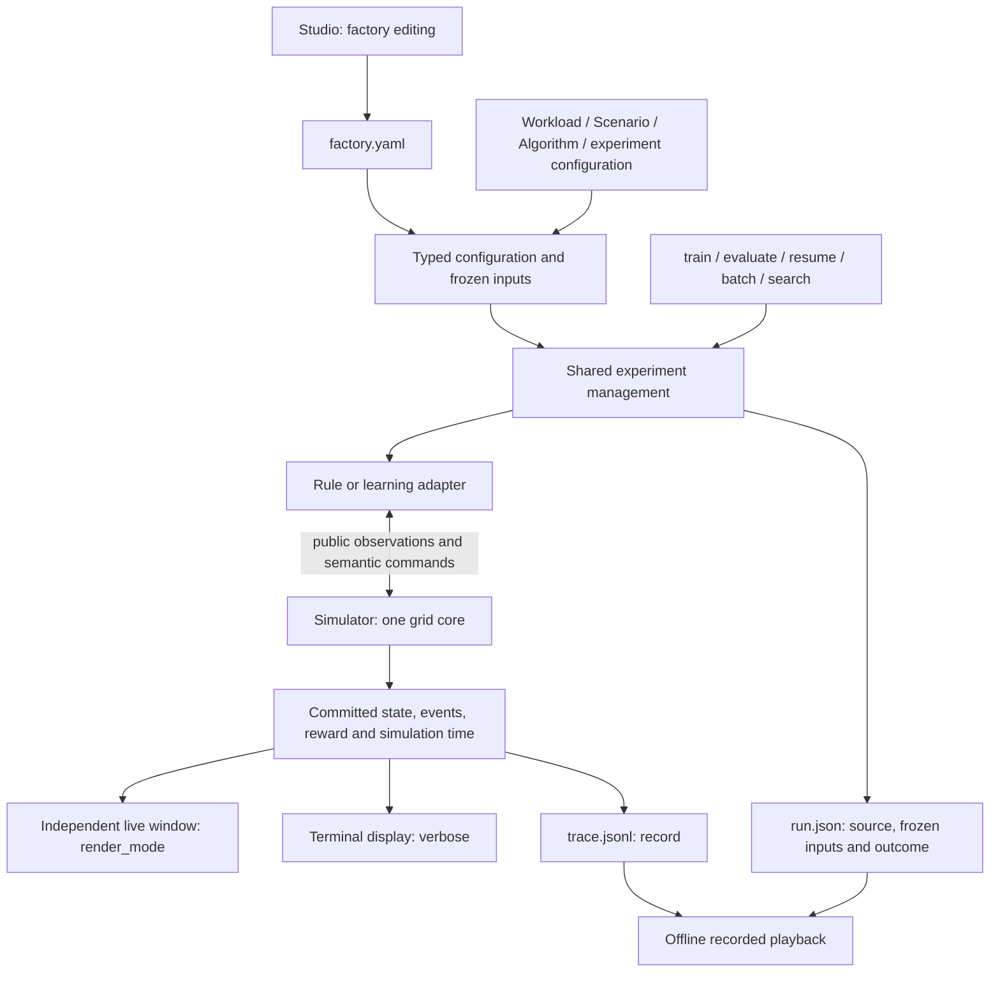

# SmartSOM Architecture

The current branch integrates the grid simulator with the original experiment
workflows. Implementation and final acceptance are distinct: see the current
[verification status](production-runtime.md). The preceding implementation is
preserved as [historical architecture](architecture-before-grid.md), not as a
second executable core. [ADR 0017](decisions/0017-grid-production-and-playback.md)
supersedes the earlier transport, storage and resource-action contracts.

## Ownership

The core owns physics and imports neither experiment orchestration, policy
frameworks, Qt nor artifact storage. Policies choose from detached public
observations; they do not advance the clock or alter feasibility. Training
management owns budgets, validation, checkpoint retention, stopping and recovery.
The renderer projects committed state and sends presentation/run controls through
a separate controller; it does not implement simulation transitions.

## Configuration and authoring

Studio and execution consume the same `FactoryDesign` and factory YAML. Workload
steps reference operation-type IDs; machine capabilities determine eligibility.
`nominal_ticks` supplies a default duration and `machine_nominal_ticks` overrides
it for existing capable machines. Time overrides cannot create capability.
Factory validation and recipe preparation happen before execution allocation.
Matrix inputs without grid positions and ports require explicit migration.

Studio edits only Factory. Immutable candidates, grouped Apply/Undo/Redo,
recovery, templates and complete-file I/O remain governed by
[ADR 0015](decisions/0015-studio-static-editor.md) and the
[factory format](factory-design.md). `authoring.operation_catalog_mode` is
portable editor metadata in the same file; it has no simulation meaning.
Workload, Scenario and Algorithm retain separate authoring responsibilities.

`ExperimentConfig` retains the original typed API/CLI fields, presets, parameter
overrides and rich output settings. `PreparedExperiment` freezes a
`ProductionRecipe`, configuration, input origins and validation episodes.
Execution workers consume this detached preparation. Batch plans freeze paired
world/policy seeds and source identities; search and reports share these paths.
There is no alternative simplified experiment runner.

## One physical transition

`smartsom.engine.Simulator` names `ProductionSimulator`. It accepts a validated
`ProductionScenario`, exposes detached `decision()`/`snapshot()` values and
commits a typed `JointCommand` through `step()`. Missing resource commands mean
WAIT. A malformed envelope raises before physical state changes; a well-formed
but infeasible proposal receives an explicit rejection in its committed tick.

A tick first resolves Buffer rankings over stable selectable job IDs. Machines,
quality stations and AGVs then propose against the same public boundary. The core
resolves claims and commits accepted actions together. Conflicting pickups,
oversubscribed destination capacity, same-cell moves and swaps reject all
competitors. A failed departure propagates to dependent movement; safe following
and non-swapping cycles can proceed. AGVs carry one job and move one cell per tick.

Processing starts only at a capable machine and uses the selected machine's
nominal time, then the processing disturbance, then the quality-mode multiplier
with the specified rounding. Outages pause remaining work; completion at an
outage boundary occurs before the outage affects subsequent work. Without PRE,
a machine physically holds READY work. Without POST, completed work stays BLOCKED
until pickup. Missing facilities never provide invisible unlimited capacity.
Slot capacities default to one; pools distinguish finite capacity from `null`.

Quality inspection locks its station, reveals the result once and preserves the
original demand identity across replacement attempts. Output accepts qualified
completed demand; confirmed scrap produces a replacement attempt. Static runs
finish when every demand qualifies, otherwise their limit produces truncation.
Dynamic runs end at their declared horizon; completing a horizon alone is not
qualified-demand completion in an acceptance report.

Energy execution, grid CP-SAT adaptation, Gantt rendering and video export are
outside this slice. The CP provider reports unsupported before run allocation.
External benchmark import and pure interval validation retain historical data;
they never invoke a hidden matrix simulator.

## Learning and experiment lifecycle

SB3, centralized RLlib and resource RLlib share `ProductionEnv` and the same
physical core. Buffer ordering uses conditional masked choices without
replacement. Intermediate adapter requests advance zero physical time; only the
joint commit advances the clock. Credit assignment uses actual elapsed time,
including `gamma ** dt` and `lambda ** dt`, rather than counting adapter requests
as simulator ticks. Resource modules cover machine, AGV, buffer and quality roles.
The sparse RLlib protocol exposes the current decision owner; it is not the old
PettingZoo Parallel action protocol.

Observation, reward and network extensions retain explicit identities, optional
registration and serializable state. They receive detached public context and
cannot see latent defects, unrealized work or unrevealed arrivals. Raw physical,
research and learner rewards remain separate. Terminal transforms receive an end
reason only when the episode actually ends.

`train`, `evaluate`, `train_evaluate` and `resume` retain their result objects and
experiment behavior. Resume continues the same directory's remaining budget,
restoring optimizer, sampler, RNG, validation and early-stopping state. Its
checkpoint identity is verified before allocating a backend. `initialize_from`
starts a separate experiment from compatible weights. Incompatible historical
action/observation encodings require retraining rather than remapping indices.
Training retains last/best and periodic checkpoints, independent seeds, ordered
local/process sampling, validation, early stopping and export. Optuna,
TensorBoard and W&B remain optional experiment tools, outside the core.

## Display, recording and audit

`render_mode=None | "human"`, boolean `verbose`, and boolean `record` are
independent. Rendering defaults off; ordinary execution/evaluation defaults to
recording. Old numeric verbosity is converted only at the read boundary.
Multiscenario evaluation renders the selected model episode, by default the first
case's first episode; the title identifies case, seed, episode and tick.

A subrun uses `run.json` plus optional `trace.jsonl`. No `render.json` or separate
timeline file is generated. Training checkpoints, metrics and batch summaries
remain separate necessary experiment artifacts. Live rendering reads in-memory
commits and works without recording. Pausing/stepping controls advancement at tick
boundaries, closing detaches and continues headless, and stopping retains a
partial outcome.

Offline playback reads stored states without executing a policy or the core.
`full_replay` and `audit` independently reexecute semantic commands and compare
state, events, rejections, rewards and learned inputs. They can use in-memory
records when disk recording is disabled. Complete and partial verification are
reported separately. The [runtime contract](production-runtime.md) documents
files, timestamps, commands and current verification limits.
