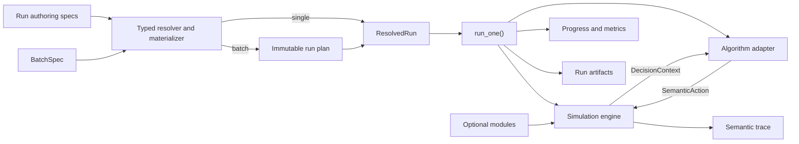

# SmartSOM Architecture

Status: The first static serial, single-mode core slice is implemented and
validated. Configuration, dynamic modules, solvers, and learning remain planned.

## Goals

SmartSOM will grow from a deterministic static FJSP core into a dynamic
manufacturing scheduling research platform. Its architecture must support new
events, resources, feasibility rules, objectives, algorithms, and experiment
scales without coupling simulator truth to one solver or learning framework.

The design follows four rules:

1. Keep the semantic core thin.
2. Compose behavior instead of building deep inheritance trees.
3. Introduce an abstraction with the first real use case, not as an empty
   placeholder.
4. Keep persisted experiment evidence separate from human-readable logging.

## Planned Execution Flow



Manual and batch execution must converge on the same `run_one()` path. A batch
runner may resolve, schedule, and aggregate child runs, but it must not contain
a second simulator or algorithm execution path.

`ResolvedRun` is the experiment runner's input, not an engine dependency. The
runner constructs the engine from validated, materialized domain inputs and
connects its selected algorithm separately. Factory resources belong to
`FactorySpec`; orders and their jobs belong to `WorkloadInstance`. Neither the
engine nor the workload owns algorithm configuration or output settings.

## Planned Package Ownership

Packages are created only when their first behavior is implemented and tested.

| Package | Responsibility |
| --- | --- |
| `domain` | Problem specifications, stable IDs, runtime state, and result types. |
| `engine` | Simulation clock, event queue, deterministic state transitions. |
| `dispatch` | Ready sets, semantic actions, candidates, and feasibility views. |
| `modules` | Composable event, resource/capability, and constraint contracts. |
| `algorithms` | Online policy, offline solver, and learning boundaries. |
| `experiments` | Typed run/batch specifications, execution, and artifact lifecycle. |
| `trace` | Structured semantic records and deterministic replay. |
| `telemetry` | Human progress, debug logs, and optional external sinks. |
| `metrics` | Algorithm-independent performance and system measurements. |
| `adapters` | Optional Gymnasium, PettingZoo, Ray, solver, and tracking bridges. |

The intended dependency direction is inward: `domain` has no project-package
dependencies; `engine` depends on domain contracts; modules implement explicit
engine extension points; algorithms consume decision projections and return
actions; experiments compose these parts. The core never imports experiment
runners or optional frameworks.

## Semantic Simulation Contract

The first action contract is `Dispatch(operation_id, processing_mode_id)`.
Simulator validity must not depend on candidate ordering or a transient array
slot. A processing mode identifies its required machine and other capabilities,
so two modes that use the same machine remain distinct. Future transport,
buffer, worker assignment, or energy decisions should be represented as
separate staged semantic decisions rather than one monolithic joint tuple.

The default lifecycle will be an event-driven hybrid semi-Markov decision
process:

1. Commit a decision when one is required.
2. Schedule resulting future events.
3. Advance directly to the next event time when no decision is available.
4. Process same-time events in a deterministic phase order.
5. Rebuild the semantic action view.
6. Expose the next decision context and write trace records.

Fixed time steps may later exist as a projection or debugging mode, but they do
not define canonical simulator time.

### First static core slice

The first implementation supports static jobs with one serial operation
chain per job, exactly one mode per operation, positive integer durations,
capacity-one machines, and non-preemptive processing. Explicit predecessor IDs
define the chain; collection positions do not. Operation IDs are unique across
the workload, while mode IDs are local to their operation. The mode collection
is retained, but multi-mode inputs are rejected until flexibility is implemented.

The implemented Python API is:

```text
Simulator(factory, workload)
Simulator.current_decision -> DecisionContext | None
Simulator.step(Dispatch) -> DecisionContext | SimulationResult
Simulator.run(OnlinePolicy) -> SimulationResult
OnlinePolicy.select_action(DecisionContext) -> Dispatch
replay(factory, workload, actions) -> SimulationResult
```

The engine exclusively owns mutable runtime state. Domain inputs, decision
snapshots, and results are immutable. A decision exposes current operation and
machine state plus legal actions and their machine/duration information.
Reading `current_decision` has no side effects. `run()` and replay both use
`step()`; replay never implements a second transition system. Each episode uses
a new simulator. The initial online protocol belongs to `dispatch`; concrete
algorithm providers are added only with their first implemented behavior.

When legal dispatches remain, the clock stays at the current tick. Otherwise,
the engine advances directly to the next completion time, processes all
completions in stable semantic-ID order, and then exposes a decision. Explicit
waiting is deferred until the static JSP/CP stage, before claiming exact replay
of external schedules that require intentional idle time.

Invalid actions fail before mutation. Deadlock, replay-length errors, and actions
after termination fail explicitly. Every transition checks runtime invariants;
completion records independently establish the terminal makespan. Canonical
traces contain decisions, dispatch/start, completion, and termination, without
paths, wall-clock timestamps, or provider provenance.

This slice uses standard-library types and hand-computable fixtures. Config
loading, resolver/CLI, persisted run artifacts, flexibility, dynamic modules,
solvers, and learning adapters remain separate implementation stages. Event
advancement and feasibility are separate responsibilities; generic hooks,
registries, and unimplemented module packages are not introduced in advance.

The [static core validation record](validation/static-core.md) documents its
tested behavior. The package table and wider execution flow remain architectural
direction; only `domain`, `dispatch`, `engine`, and `trace` have implementations.

## Extension Taxonomy

The word "constraint" does not cover every future extension:

- Online job arrival and machine breakdown/repair are event modules.
- Buffers, transporters, and energy systems are resource/capability modules.
- Capacity, compatibility, and energy limits are feasibility constraints.

Modules may contribute only through declared contracts such as event handling,
state extensions, candidate filtering, transition consequences, observations,
or metrics. The simulator remains the sole owner of canonical state changes.

## Algorithm Boundaries

The planned minimum interfaces are:

```text
OnlinePolicy.select_action(DecisionContext) -> SemanticAction
SolverAdapter.solve(SolveRequest) -> ScheduleSolution
run_one(ResolvedRun) -> RunResult
run_batch(BatchSpec) -> BatchResult
```

Dispatching rules and online heuristics implement `OnlinePolicy`. Full-
information CP, MILP, planning, or genetic algorithms implement
`SolverAdapter`. A rolling-horizon solver is exposed through an online adapter
that declares its information assumptions. A learned policy uses the same
online interface, while training belongs to an optional `Learner` boundary.
MARL waits for an explicit decision-group contract.

Built-in algorithms implement these interfaces directly. Optional framework
integrations live in shared adapters selected through stable provider IDs. A
configuration does not define an adapter or contain an absolute Python import
path. Adapters translate decision projections and results, but the simulator
remains the sole owner of canonical state.

`SolveRequest` contains the resolved scenario, objective, budget, effective
solver seed, and information contract. `ResolvedRun` contains normalized
specifications, materialized input references and digests, effective seeds,
provider identity, objective, budget, and output policy. These execution types
are distinct from user-authored `RunSpec` files that may still contain
references.

## Configuration Contracts

Human-authored configuration will use composable YAML files; materialized
instances and event streams use JSON or JSONL. All are validated into typed
models:

- `FactorySpec`: static resources, capabilities, calendars, buffers, and any
  available layout or travel-time representation.
- `WorkloadProfile`: job, order, and demand generation assumptions.
- `WorkloadInstance`: the fully materialized hierarchy described by
  `Order -> Job -> Operation -> ProcessingMode`. Each mode owns its required
  resources and nominal duration.
- `ScenarioSpec`: factory plus exactly one workload source, enabled dynamic
  modules or a fixed event set, maximum information visibility, horizon, and
  termination.
- `AlgorithmSpec`: stable provider ID, interface kind, parameters, required
  information scope, and optional checkpoint.
- `RunSpec`: one scenario plus one algorithm, objective, budget, root seed,
  telemetry policy, and output root.
- `BatchSpec`: replications, algorithm comparisons, typed parameter sweeps,
  batch root seed, concurrency, resume, and failure policy.

A normal run references five reusable files: a factory, a workload profile or
materialized instance, a scenario, an algorithm, and a run. The user invokes
the run file; the typed resolver follows references and persists the fully
resolved result. Dynamic declarations stay in the scenario, so static
experiments do not need an empty event file. A scenario may instead reference a
materialized event set for exact replay.

Every value has one authoritative owner. Generator matrices are import or
generation inputs rather than a second runtime representation. Generators run
before simulation, and the engine consumes only a validated materialized
instance and realized event stream. Online workloads distinguish physical
`release_at` from observable `reveal_at`. Established benchmark encodings such
as `.fjs` are translated into `WorkloadInstance` at this same ingress boundary.

Numeric seeds are owned by `RunSpec` or, when expanding a study, `BatchSpec`.
For a batch, a versioned stable derivation scheme first keys a world root by the
non-algorithm parameter cell and replication index. Workload, demand, machine
events, and processing-time noise derive from that root; algorithm and solver
seeds additionally include the algorithm-variant identity. Each world is
materialized once, and paired algorithms reference identical instance and event
digests. Deterministic same-time event ordering is an engine invariant, not a
seed domain.

Scenario visibility is the maximum environment information available. An
algorithm declares what it requires, and resolution rejects an incompatible
pair before execution. The manifest records the resulting information
projection as evidence rather than acting as another configuration authority.

The planned CLI has four entry points:

```text
smartsom validate CONFIG
smartsom plan CONFIG
smartsom run RUN_CONFIG
smartsom batch BATCH_CONFIG
```

Planning is read-only: it shows resolved references, effective seeds, child-run
count, and sweep differences without simulating. Scientific grids live in
`BatchSpec`; permitted operational CLI overrides must be recorded in resolved
configuration and the manifest. Batch dimensions use deterministic ordered
Cartesian expansion by default; zip expansion is explicit. Each child has a
stable plan-entry identity used with resolved input digests for resume.

Pydantic and YAML libraries will be added with the first file-authoring schema,
not as unused scaffold dependencies. Every run persists its fully resolved
configuration so referenced source files are not required for later auditing.

The complete ownership and execution decision is recorded in
[`0002 — Experiment Configuration and Execution Contract`](decisions/0002-experiment-configuration-and-execution.md).

## Run Evidence and Logging

Local run artifacts are authoritative. External systems such as W&B may later
mirror metrics and artifacts, but they cannot replace the local replay record.

```text
runs/<run_id>/
  resolved_run.yaml
  manifest.json
  realized_instance.json  # after materialization
  realized_events.jsonl  # when dynamic events are present
  progress.log
  trace.jsonl        # after simulation starts
  metrics.jsonl      # after simulation starts
  summary.json
  debug.log        # optional
  failure.json      # present on failure
```

A run directory is allocated only after authoring and cross-reference
validation succeeds. From that point, `resolved_run.yaml`, `manifest.json`,
`progress.log`, and `summary.json` are retained for every attempt; the manifest
is finalized with status and all available digests. Later-stage artifacts are
required only if their producing stage is reached.

- `progress.log` mirrors line-buffered terminal progress for human monitoring.
- `trace.jsonl` records semantic events, decisions, actions, and transitions
  required for replay without storing full state snapshots by default.
- `metrics.jsonl` stores structured time-series values for analysis and future
  tracking sinks.
- `debug.log` contains opt-in internal diagnostics and exception stacks.
- `manifest.json` binds resolved configuration, Git identity, environment,
  seeds, information assumptions, and artifact digests.
- `realized_instance.json` is the canonical materialized workload consumed by
  the engine, whether imported or generated.
- `realized_events.jsonl` records the fixed dynamic input presented to all
  paired algorithms when dynamic modules are active.
- `summary.json` records terminal metrics, status, and end reason.
- `failure.json` preserves structured failure information; failed runs are not
  silently dropped from a batch.

A batch stores `resolved_batch.yaml`, an immutable `run_plan.jsonl`, an
aggregate `batch_summary.json`, and one ordinary run directory per child. Each
child remains independently runnable and auditable through the same
`run_one()` contract.

Generated run content is excluded from Git unless an explicitly approved small
fixture or example is required for tests or documentation.

## Dependency Policy

The base package must remain lightweight. Optional solver, Gymnasium, learning,
MARL, and tracking dependencies will be introduced as separate extras with the
adapter that needs them. Importing `smartsom` must not import or require those
frameworks.
