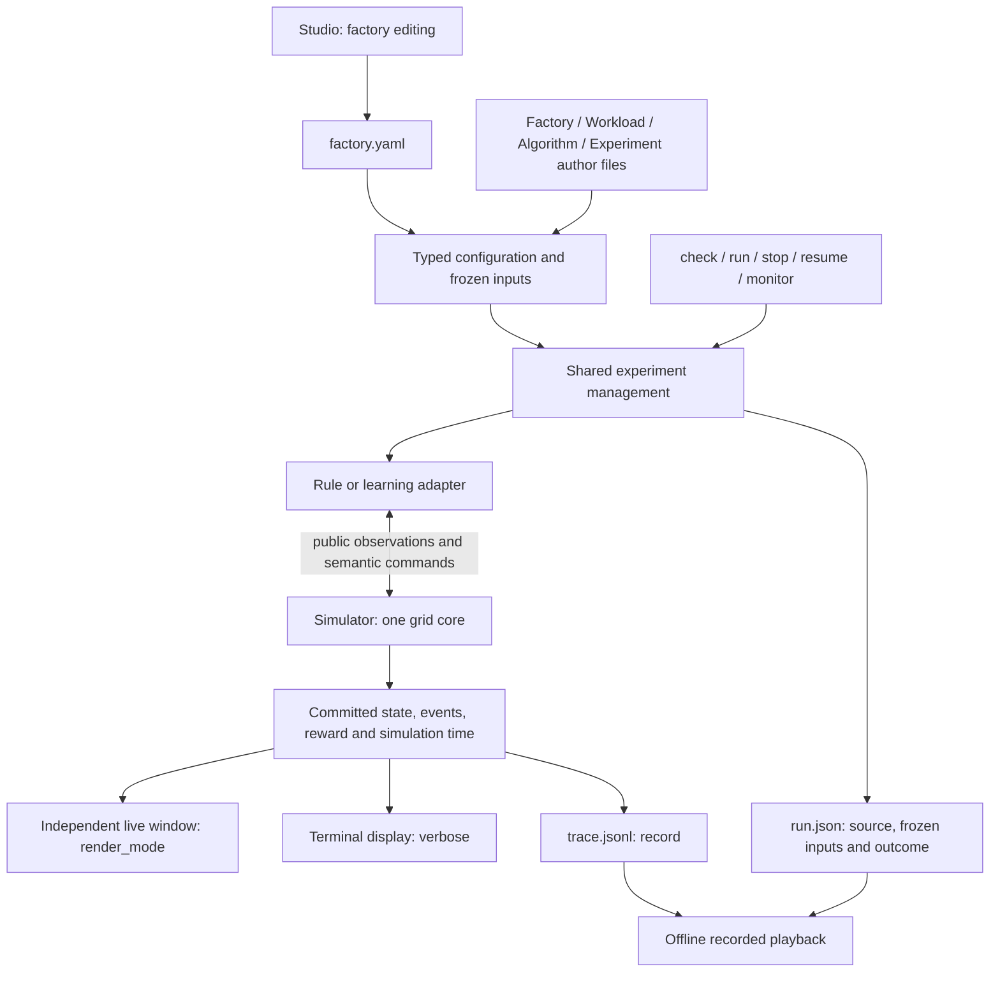

# SmartSOM Architecture

The current branch integrates the grid simulator with the original experiment
workflows. Implementation and final acceptance are distinct: see the current
[verification status](production-runtime.md). The preceding implementation is
preserved as [historical architecture](architecture-before-grid.md), not as a
second executable core. [ADR 0017](decisions/0017-grid-production-and-playback.md)
supersedes the earlier transport, storage and resource-action contracts.

## Ownership

```mermaid
flowchart TD
    S["Studio: factory editing"] --> F["factory.yaml"]
    F --> C["Typed configuration and frozen inputs"]
    Y["Factory / Workload / Algorithm / Experiment author files"] --> C
    U["check / run / stop / resume / monitor"] --> E["Shared experiment management"]
    C --> E
    E --> A["Rule or learning adapter"]
    A <-->|"public observations and semantic commands"| K["Simulator: one grid core"]
    K --> T["Committed state, events, reward and simulation time"]
    T --> H["Independent live window: render_mode"]
    T --> D["Terminal display: verbose"]
    T --> L["trace.jsonl: record"]
    E --> R["run.json: source, frozen inputs and outcome"]
    R --> P["Offline recorded playback"]
    L --> P
```

The core owns physics and imports neither experiment orchestration, policy
frameworks, Qt nor artifact storage. Policies choose from detached public
observations; they do not advance the clock or alter feasibility. Training
management owns budgets, validation, checkpoint retention, stopping and recovery.
The renderer projects committed state and sends presentation/run controls through
a separate controller; it does not implement simulation transitions.

## Configuration and authoring

Studio and execution consume the same `FactoryDesign` and factory YAML. Workload
steps reference operation-type IDs; machine capabilities determine eligibility.
`nominal_ticks` supplies a default duration and `machine_nominal_ticks` overrides
it for existing capable machines. Time overrides cannot create capability.
Factory validation and recipe preparation happen before execution allocation.
Matrix inputs without grid positions and ports require explicit migration.

Studio edits only Factory. Immutable candidates, grouped Apply/Undo/Redo,
recovery, templates and complete-file I/O remain governed by
[ADR 0015](decisions/0015-studio-static-editor.md) and the
[factory format](factory-design.md). `authoring.operation_catalog_mode` is
portable editor metadata in the same file; it has no simulation meaning.
New daily inputs use [four-file authoring](four-file-workflow.md), governed by
[ADR 0025](decisions/0025-four-file-authoring-and-background.md). The author compiler
creates detached Scenario/Composition/Policy objects in memory. Scenario remains
an internal physics recipe; shared author files are never changed by execution.
Legacy v2/v3 inputs retain their original ownership and identity computation.

Algorithm selects registered public rules, role groups or an exclusive central
controller. The generic task driver saves stage ledgers for native single and
matrix plans. Explicit POSIX background processes consume these same frozen
inputs; process ownership and execution sidecars are independent of scientific
configuration. New training calibration chooses Tune concurrency and the
sampling layout before formal training; manual `execution.max_concurrent` is
its starting candidate or controls native workers when tuning is off. The
sampling layout is frozen across recovery, while later adaptive resizing changes
only learner threads and experiment concurrency; see
[ADR 0027](decisions/0027-balanced-performance-calibration.md).

The bundled four-machine Template 1 remains the default. Template 2 provides
the larger eight-machine layout; Template 3 provides a compact 12×8 layout with
eight machines, four shared operation types and two inspection stations. Templates 4–6
provide Small (19×11, 8 machines/AGVs), Medium (29×17, 20 machines/AGVs) and
Large (39×23, 40 machines/AGVs). Each has single-cell resources, three-cell
inspection–scrap–inspection groups, upper/lower PRE/POST access, and mirrored
AGV starts. They retain ten operation types and dual-capability machines.
Templates 7–9 add 8/16/32-machine layouts with matching AGV counts, four operation
types, three speed modes, continuous edge I/O pools with 2/4/8 ports per side,
and 2/4/8 four-place inspection stations sharing 1/2/4 local scrap bins. They omit chargers.
Templates 10–12 retain the maps and settings of Templates 7–9 with 10/20/40 AGVs,
respectively; the original templates remain unchanged.
All twelve use complete factory YAML with explicit port bindings. Multiple inputs
retain the existing explicit demand `input_id` execution contract; see
[ADR 0018](decisions/0018-multiple-system-buffers.md).

`ExperimentConfig` retains the original typed API/CLI fields, presets, parameter
overrides and rich output settings. `PreparedExperiment` freezes a
`ProductionRecipe`, configuration, input origins and validation episodes.
Execution workers consume this detached preparation. Batch plans freeze paired
world/policy seeds and source identities; search and reports share these paths.
There is no alternative simplified experiment runner.

## One physical transition

`smartsom.engine.Simulator` names `ProductionSimulator`. It accepts a validated
`ProductionScenario`, exposes detached `decision()`/`snapshot()` values and
commits a typed `JointCommand` through `step()`. Missing resource commands mean
WAIT. A malformed envelope raises before physical state changes; a well-formed
but infeasible proposal receives an explicit rejection in its committed tick.

A tick first resolves Buffer rankings over stable selectable job IDs. Machines,
quality stations and AGVs then propose against the same public boundary. The core
resolves claims and commits accepted actions together. Conflicting pickups,
oversubscribed destination capacity, same-cell moves and swaps reject all
competitors. A failed departure propagates to dependent movement; safe following
and non-swapping cycles can proceed. AGVs carry one job and move one cell per tick.

Processing starts only at a capable machine and uses the selected machine's
nominal time, then the processing disturbance, then the quality-mode multiplier
with the specified rounding. Outages pause remaining work; completion at an
outage boundary occurs before the outage affects subsequent work. Without PRE,
a machine physically holds READY work. Without POST, completed work stays BLOCKED
until pickup. Missing facilities never provide invisible unlimited capacity.
Slot capacities default to one; pools distinguish finite capacity from `null`.

Quality inspection locks its station, reveals the result once and preserves the
original demand identity across replacement attempts. Output accepts qualified
completed demand; confirmed scrap produces a replacement attempt. Static runs
finish when every demand qualifies, otherwise their limit produces truncation.
Dynamic runs end at their declared horizon; completing a horizon alone is not
qualified-demand completion in an acceptance report.

Energy execution, grid CP-SAT adaptation, Gantt rendering and video export are
outside this slice. The CP provider reports unsupported before run allocation.
External benchmark import and pure interval validation retain historical data;
they never invoke a hidden matrix simulator.

## Learning and experiment lifecycle

Composable v3 preparation freezes Machine, Buffer, Dispatcher and Mover policy
bindings, independent validation/evaluation cases and physical-tick budgets.
Resource PPO/Double DQN and centralized PPO use the same production kernel;
explicit travel-time-matrix scenarios use its staged v3 protocol. The original
v2 APIs, replay and strict continuation contracts remain available. See
[ADR 0020](decisions/0020-composable-policies-and-physical-tick-learning.md),
[ADR 0021](decisions/0021-travel-time-matrix-and-small-hv-study.md) and
[ADR 0022](decisions/0022-composable-study-process-concurrency.md).

Engineering configurations remain classified under `configs/test/`. Historical
verification documents preserve their original commands and source identities;
current authoring guides use the migrated paths.

SB3, centralized RLlib and resource RLlib share `ProductionEnv` and the same
physical core. Inspection has no policy role; linked local disposal follows [ADR 0019](decisions/0019-automatic-inspection-and-local-disposal.md).
V3 Dispatcher destinations use observable quality: only UNKNOWN jobs may enter
inspection, including between processing operations. PASS jobs continue processing
or go to Output after their final operation; FAIL jobs must go to scrap. Every
completed processing operation resets observable quality to UNKNOWN while retaining
accumulated latent defects. Finished UNKNOWN jobs may also go directly to Output,
which reveals quality and replaces rejected attempts without satisfying demand.

V3 evaluation reports fixed-job makespan from tick zero and exact fixed-job total tardiness
only when all original demands have qualified deliveries. Unfinished cases expose
null exact values and a labelled tardiness lower bound including overdue unfinished
demands. Legacy `total_tardiness` sums delivered jobs only and is labelled censored
when original demands remain unfinished; `fixed_job_total_tardiness` is then null.
On-time delivery means at or before `due_at`, divided by all original
demands. Passing rate is qualified Output deliveries divided by Output submissions;
pre-Output scrap is separate and zero submissions give an unavailable rate. Legacy
`mean_makespan` is conditional on completed cases; `mean_fixed_job_makespan` requires
all cases to finish. Makespan-first selection uses the existing `all_complete` mode
and fixed validation worlds, with earlier checkpoints retained on ties. These
reporting and routing rules do not change the reward function.
Strict full replay audits are bound to their recorded source implementation:
old V3 recordings have different legal candidate lists and summary fields.
Historical playback remains readable from recorded state, but a cross-version
full audit is not equivalent to an audit under the original source snapshot.
Continuation also checks implementation identity and rejects changed source.

Buffer ordering uses conditional masked choices without
replacement. Intermediate adapter requests advance zero physical time; only the
joint commit advances the clock. Credit assignment uses actual elapsed time,
including `gamma ** dt` and `lambda ** dt`, rather than counting adapter requests
as simulator ticks. Resource modules cover machine, AGV and buffer roles.
The sparse RLlib protocol exposes the current decision owner; it is not the old
PettingZoo Parallel action protocol.

Observation, reward and network extensions retain explicit identities, optional
registration and serializable state. They receive detached public context and
cannot see latent defects, unrealized work or unrevealed arrivals. Raw physical,
research and learner rewards remain separate. Terminal transforms receive an end
reason only when the episode actually ends.

`train`, `evaluate`, `train_evaluate` and `resume` retain their result objects and
experiment behavior. Resume continues the same directory's remaining budget,
restoring optimizer, sampler, RNG, validation and early-stopping state. Its
checkpoint identity is verified before allocating a backend. `initialize_from`
starts a separate experiment from compatible weights. Incompatible historical
action/observation encodings require retraining rather than remapping indices.
Training retains last/best and periodic checkpoints, independent seeds, ordered
local/process sampling, validation, early stopping and export. Optuna,
TensorBoard and W&B remain optional experiment tools, outside the core.

## Display, recording and audit

`render_mode=None | "human"`, boolean `verbose`, and boolean `record` are
independent. Rendering defaults off; ordinary execution/evaluation defaults to
recording. Old numeric verbosity is converted only at the read boundary.
Multiscenario evaluation renders the selected model episode, by default the first
case's first episode; the title identifies case, seed, episode and tick.

A subrun uses `run.json` plus optional `trace.jsonl`. No `render.json` or separate
timeline file is generated. Training checkpoints, metrics and batch summaries
remain separate necessary experiment artifacts. Live rendering reads in-memory
commits and works without recording. Pausing/stepping controls advancement at tick
boundaries, closing detaches and continues headless, and stopping retains a
partial outcome.

Offline playback reads stored states without executing a policy or the core.
`full_replay` and `audit` independently reexecute semantic commands and compare
state, events, rejections, rewards and learned inputs. They can use in-memory
records when disk recording is disabled. Complete and partial verification are
reported separately. The [runtime contract](production-runtime.md) documents
files, timestamps, commands and current verification limits.

Ray Tune execution is an optional driver-layer adapter: frozen inputs and native
update commits remain separate from scheduling. See [ADR 0023](decisions/0023-ray-tune-adaptive-execution.md)
and the [batch workflow](ray-tune-workflow.md).

Unified task dispatch and local cooperative stop are driver responsibilities,
with control records separate from scientific inputs. See
[ADR 0024](decisions/0024-explicit-tasks-and-cooperative-stop.md) and the
[command workflow](command-workflow.md). Old entries retain their semantics.
