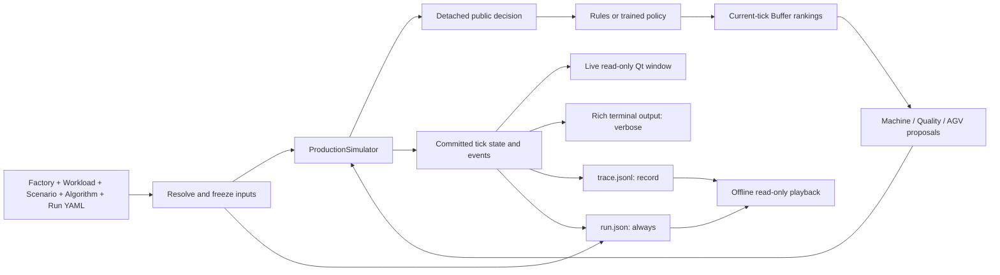

# Grid production runtime and playback

Implementation status: grid production, training and playback are implemented.
Public training, evaluation and resume use the grid core through the experiment
configuration. Direct execution paths have been consolidated. The September 14
development gate recorded 1614 passing tests, with no skips; native mouse
interaction and Terminal-input limitations below remain outstanding acceptance items.
Historical validation records describe their recorded source commits, not this
working tree.

## Ownership and files



A run directory contains `run.json` and, when `record: true`, `trace.jsonl`.
`run.json` is one JSON document containing frozen inputs, source identity,
initial/final state and outcome. `trace.jsonl` is newline-delimited JSON, one
committed physical tick per line. It records semantic proposals, applied rankings,
rejections, events, reward, state and state hash. Learned evaluation also records
candidate identities, masks, selected indices, policy scores and hashes of the
actual float32 observations. Full observation values use `logging.observations:
full`. Each decision records raw, research and learner rewards and the state
hashes before and after custom observation/reward hooks. The frozen hook state
and any decisions interrupted before a physical tick commits remain in
`run.json`; they do not create a third file. These are
structured logs; the filename extension does not determine whether data is a log.

Live rendering consumes detached in-memory records. It neither reads a growing
file nor requires recording. Offline playback reads recorded states and never
executes policies or physics. `audit` separately reexecutes the semantic actions
and compares every state, reward, rejection and event. Learned runs additionally
reconstruct the encoded decision sequence and hook state without running model
weights. Missing decision evidence is an error. An unfinished run reports
`partial_verified`, even when all recorded transitions agree. Full snapshots currently
favor simple, inspectable playback over file size; indexing is held in memory,
with no extra index file. Interrupted recordings may expose their complete
prefix. A finished trajectory with missing or corrupt ticks is an error.

A row's tick identifies the committed state at the end of that tick. Events keep
their actual boundary time: a pickup at time 0 appears in the state committed at
tick 1. Processing started at time 3 with duration 2 completes at time 5. Terminal
event timestamps and viewer state timestamps therefore describe different points
in the same transition. Derived reports preserve these boundaries and mark work
still active at the end of a recording as incomplete.

The renderer is an independent window sharing Studio's scene and symbols. Studio
continues to edit factories only. The window can pause the producer, request one
tick, change presentation speed, or stop the run. Closing a paused window detaches
it and resumes headless execution. Offline playback supports seeking and reverse
single stepping. Wall-clock display speed never changes simulated time.
Multi-case evaluation displays only the selected model episode (the first case's
first episode by default). Remaining model and baseline episodes continue without
rendering while that window stays open. The title identifies case, seed and episode.

## Physical contract

Factory YAML is the current grid design also used by Studio. Workload routes
reference the factory's operation types, and capability matching determines which
machines can process a step. No machine-ID routing fallback is used. Portable
`authoring` preferences remain editor metadata and do not enter execution.

Each integer tick first resolves complete Buffer rankings over selectable jobs.
Other decisions see those rankings, then propose concurrently. Semantic resource
and job IDs survive array encoding. AGVs have capacity one and move one cell per
tick with UP/DOWN/LEFT/RIGHT/INTERACT/WAIT; active ports allow all headings and serve
one facility. Facility footprints and blocked cells are obstacles. Same-target
moves, swaps, conflicting job claims and over-subscribed capacity claims reject
all competing proposals. Rejections propagate when a proposed departure fails.
Safe following and non-swapping movement cycles are allowed.

A direct machine drop creates READY work; START chooses job and quality mode.
Without PRE, the machine holds that waiting job. Without POST, finished work
remains BLOCKED until pickup. Explicit PRE/POST facilities retain their capacities.
A missing facility never implies unlimited caching. Slot buffers preserve each
slot's capacity; pools use finite capacity or `null` for unlimited. Accepted output
jobs occupy output capacity. Confirmed scrap occupies scrap-bin capacity.

Each workload step declares `nominal_ticks` and may override it with a
`machine_nominal_ticks` mapping. An override changes time only: the referenced
machine must already support the operation type. Missing or incapable machine
references are errors. Choose the machine-specific or default base time first,
then apply the configured uncertainty bounds. Apply the mode's
time multiplier afterward, using positive half-up rounding at each stage and a
minimum of one tick. Keyed random draws bind seed, attempt and operation identity.
A machine outage pauses remaining work; repair resumes the same job and mode.
Completion on an outage boundary wins. Inspection locks the whole station, takes
FIFO UNKNOWN residents up to parallel capacity, and reveals PASS/FAIL at completion.
Known results are not retested. FAIL jobs go to scrap; final output accepts finished
UNKNOWN/PASS jobs and performs automatic acceptance for UNKNOWN quality. Rejected
or scrapped attempts enqueue a replacement of the same original demand, due date
and priority, without duplicating live demand.

Static completion requires all original demands to be qualified. Reaching the
static safety horizon with outstanding demand is `truncated`, never success.
Dynamic execution ends at its fixed horizon. Generated arrivals and outages use
separate named random streams. Announcements may precede physical release.
Actors do not receive future outages, latent defects or true unfinished processing
duration. Battery/charging fields remain authoring data; energy execution is
inactive in this slice. Charging does not consume or restore energy.

Scenario `processing_samples` can freeze a base processing duration with
`demand_id`, `operation_id`, `machine_id`, `actual_ticks` and optional `attempt`
(default 1). That duration is selected before applying the quality-mode time
multiplier. `quality_samples` freezes `demand_id`, `operation_id`, `draw` and
optional `attempt`; the draw is an integer in `[0, 2**53)`. Replacement attempts
without explicit samples receive their own keyed draws. Invalid references and
duplicate sample identities fail before allocating runtime state.
`quality_probability_visibility: hidden` masks both the current risk and candidate
mode error probabilities; it does not change physical outcomes. This visibility
choice is part of the checkpoint observation contract.

Generated workloads specify either a fixed `profile.route` or sampled
`profile.operation_types` with `min_operations` and `max_operations`.
`machine_duration_variation` samples independent nominal times for capable
machines within the authored nominal bounds. Generated outage profiles can set
`until_tick` to limit the outage-generation window independently of the run horizon.

## Learning and checkpoints

SB3 MaskablePPO and centralized RLlib PPO share a sequential decision projection.
Resource RLlib PPO has shared Machine, AGV, Buffer and Quality policies. Ranking
uses categorical sampling without replacement over stable candidate identities;
its masks shrink while candidate features remain fixed. Conditional decisions
within a physical tick take zero simulated time. GAE uses physical elapsed time
for both discount and lambda decay. Resource rewards accumulate between that
resource's decision opportunities.

The grid core's raw reward is a production objective, not the old matrix
negative-makespan reward. For each committed tick it adds ten times the priority
of newly qualified demands, subtracts the outstanding released priority divided
by `reward_time_scale`, and subtracts an additional five times overdue priority
divided by that scale. Outstanding and overdue counts are measured at the start
of the tick; a demand is overdue when the current tick reaches its due time.
Starting an inspection batch costs 0.1, first revealing a failed job costs 1, and
each AGV proposal rejected for a conflict costs 0.02. At a dynamic horizon, each
remaining released demand additionally costs ten times its priority. The default
time scale is 100. Thus the one-job, priority-one, on-time eight-tick task returns
`10 - 8 / 100 = 9.92`. Observation/reward extensions and learner scaling operate
on separate streams; they do not change this raw accounting or physical outcomes.

RLlib aligns every batch column in the same episode/semantic-agent order before
role batching. Learner masks must match sampled policy support. Bootstrap records
are used to compute value targets, then removed before minibatching. A role absent
from an update has no measured KL; it must not adjust its coefficient from an empty
metric. Actual non-finite losses or measured KL fail training.

The original `train(config)`, `train_prepared(prepared)`, `evaluate(source, options)`,
`train_evaluate(config)` and `resume(source)` entry points remain. Experiment
configuration owns budgets, validation, checkpoint retention, runtime and output
controls; algorithms do not replace that lifecycle. Presets and CLI overrides
resolve to the same frozen recipe. Ordered logical streams retain their identities
whether sampling happens locally or in worker processes.

Training directories additionally contain model weights, framework checkpoints,
episode/learner ledgers and serialized sampler state. `resume` stays in the same
experiment and consumes its remaining original budget. It restores optimizer,
sampler, extension, validation and RNG state. An exhausted experiment cannot be
extended implicitly. `initialize_from` creates a new experiment from weights and
their learned observation state. Reward-hook state and training counters start
fresh; every logical sampling stream starts with the same saved observation state.
Validation drives best selection and early stopping; retained references protect
models used by evaluations and reports from automatic checkpoint cleanup.
Initialization additionally checks action/observation versions, candidate capacity,
input scaling, observation extensions and network structure before loading weights.
Changing optimizer settings for a new experiment does not reinterpret model inputs.
Evaluation accepts another checkpoint or exported model as a baseline. Each model
retains its own checkpoint identity and reference protection while consuming the
same materialized worlds. Auditing an evaluation checks plan coverage, pairing,
child outcomes and summaries as well as each recorded trajectory. Without a saved
trajectory, a later audit reports partial verification; the earlier in-memory
execution check is not treated as reproducible recorded evidence.

Batch simulation uses the same frozen `run_one` path as ordinary execution. Its
plan and snapshots belong to the coordinator; each simulation child still contains
only `run.json` and `trace.jsonl`. Resume verifies both the frozen input identity
and execution audit before reusing completed children. Physical-facility comparisons
require explicit factory/scenario cases; removing a transport/buffer switch cannot
restore the old free-transport or unlimited-storage semantics.

Named observation, reward and feed-forward network extensions remain available.
Observation hooks receive detached public feature groups, semantic candidates and
masks. They never receive the simulator, future calendar or hidden defect/duration
state. Encoded observations are cached once per decision; repeated reads do not
advance stateful hooks. Reward transforms cannot modify committed physical state.
The four resource roles can choose different observation and network definitions.

Training episode limits count adapter decisions and elapsed simulation ticks.
A decision limit can stop between conditional choices; unfinished proposals are
discarded without advancing the physical clock. Such a prefix is a truncation,
not a completed manufacturing episode.
Checkpoint manifests bind the factory and observation/action configuration;
loading an incompatible factory fails. Checkpoints contain framework serialization
and are intended for local trusted training artifacts. No rule policy replaces a
loaded model during evaluation. A saved model and a successful engineering run do
not establish convergence or scheduling performance.

## Current commands

```bash
uv run smartsom validate --config configs/runs/run_test.yaml
uv run smartsom run --config configs/runs/dynamic_production.yaml --render-mode human
uv run smartsom train --config configs/runs/sb3_production.yaml
uv run smartsom evaluate PATH_TO_CHECKPOINT --render-mode human
uv run smartsom evaluate PATH_TO_CHECKPOINT --no-record --no-verbose
uv run smartsom resume PATH_TO_EXPERIMENT
uv run smartsom playback PATH_TO_RUN
uv run smartsom audit PATH_TO_RUN
uv run smartsom init generated_fjsp NEW_PROJECT_DIRECTORY
uv run smartsom import-fjs data/reference/mk01/Mk01.fjs --factory configs/factories/mk01.yaml --output-dir NEW_PROJECT_DIRECTORY
```

Python uses `render_mode=None | "human"`, `verbose: bool`, `record: bool`.
Each switch is independent. Training/evaluation outputs are local development
evidence; they are not committed. Formal regression tests remain in the repository.

Multi-case evaluation renders only the model's first replication of the first
case by default. `--render-case` and `--render-replication` select another episode;
replication selection is one-based. Other replications and baselines continue
without a window. The title identifies the case, seed and replication. Execution
auditing (`full_replay`) can operate in memory when `record` is false. Reports
derive timelines from the existing trace and do not require another timeline log.

## Repository examples and authoring migration

Bundled factory examples now explicitly author a facility row and two walkable
rows, ports, input/output pools and distinct AGV initial cells. Capability types
preserve the examples' eligible machine sets; workload tables preserve their
machine-specific nominal durations. Explicit capacities, fixed processing draws,
arrival announcements, quality draws and outage intervals are retained. The
former `factory_test` references used by larger hand cases now point to
`factory_hand`; the small eight-tick runtime fixture remains separate.

These are newly authored grid examples, not an equivalent conversion of matrix
travel costs. Transport times, pickup/drop times and resulting schedules must be
measured again. The old arrival trigger aliases now share the atomic tick protocol.
Arrival examples use a finite dynamic horizon. Historical benchmark files under
`data/reference` retain their original source identity and results.

`builtin.scripted` consumes one explicit joint `commands` entry per physical tick.
An empty entry means WAIT. Entries use semantic AGV, machine, quality and ranking
identities. Exhausting a script before termination is a recorded failure.
Historical operation-selection scripts fail with a migration message. The bundled
fast/slow scripts explicitly choose the corresponding machine for A1; the buffer
script exercises a full POST and blocked machine, and the holding script includes
an actual storage drop, wait and pickup. Their grid command schedules are new
fixtures rather than old matrix reference schedules.

`init` creates self-contained grid projects, and preview validates/materializes
inputs without constructing a simulator. FJS files contain processing data but no
layout, ports or transport facilities, so `import-fjs` requires `--factory`.
Machine IDs default to FJS M1, M2, and so on; optional `--machine-map` reads a JSON
mapping to existing factory IDs. An operation must match a catalog type with
exactly the FJS eligible machines. Repeated alternatives on one machine require
manual resolution and are never silently collapsed. The imported workload keeps
its provenance and the project retains the original FJS bytes. No user factory or
local Studio template is batch migrated.

### IDETC-derived grid examples

`configs/studies/idetc_spt.yaml` now prepares the current grid scenarios named
`idetc_grid_S00` through `idetc_grid_S11`. The four case IDs and the 3 × 5 algorithm
and replication pairing remain stable. The input job IDs, operation types,
nominal durations, release times and machine capability maps are copied from the
frozen raw reference. Two workloads represent the arrival settings, and two
factory documents represent the capability settings.

The layout is explicitly authored from the repository's learning-micro grid:
two travel rows, a row of facilities, one-cell moves, four AGVs, finite six-place
PRE/POST stores, and a finite 999999-place holding store. Quality uses an explicit
inspection station and scrap bin. It is not inferred from the historical travel
matrix. The scenario runs a dynamic 20000-tick horizon; experiment limits can end
it earlier, which is reported as truncation. A completed horizon alone does not
satisfy the study audit's requirement that every original demand qualify.

These are different physical experiments from the paper: transport, contention,
inspection, replacement and completion rules differ. Historical paper numbers
remain source references only. `validate_idetc.py` marks grid reports as
`paper_comparison: incompatible_physics`; it does not apply the historical
quality-mode subset acceptance condition to replacement runs. Raw files and
byte-reproducible historical conversion exports remain unchanged under
`data/reference/idetc`. Reexecuting historical matrix evidence requires its
recorded source checkout; the current audit does not dispatch to the old engine.

## Development verification and migration status (2026-09-14)

The current branch is still uncommitted and unaccepted. The public API study
integration checks cover train/resume/evaluate, exported and relocated models,
frozen authoring inputs, parallel sampling, batch reuse, and Optuna persistence.
A fresh run of those checks passed 11 tests. Recovery and reward-isolation checks
passed 24 tests across SB3, centralized RLlib, and resource RLlib; grid-only local
and process sampling passed 9 tests. These tests compare optimizer state, random
state, episode ledgers, validation isolation, and actual network weights.

`test_grid_model_acceptance.py` separately trained each of the three backends for
16384 adapter decisions on the deterministic one-job task. All three saved,
reloaded, and completed all three evaluation episodes at the hand-calculated tick
8. A separate 32768-decision quality task verified updates in both actor and critic
of all four resource modules, and loaded all four modules for inference. This is
bounded engineering verification, not a convergence or superiority claim on the
larger learning-micro factory. The quality test does not label a truncated
inference episode completed.

The old 1024/4096-step fixed recipes now have much larger grid action sequences.
Their former matrix completion expectations are not transferable. The acceptance
scripts freeze new explicitly named grid recipe identities, audit every planned
child (including partial trajectories), and retain strict qualified-completion
and four-role-update gates. Incomplete episodes or unvisited resource modules
cause a failed acceptance report. CI checks truthful failure reporting for these
short-budget diagnostics; the separate deterministic model tests above establish
actual completed-policy behavior. No historical acceptance document or raw
reference result is relabeled as grid evidence.

The final complete `pytest -q --tb=short` run passed **1614 tests**, with no skips,
in 1178.99 seconds. Its 91 warnings concern Ray's repeated Gym registration,
unbounded Box advisories and a protobuf UTC deprecation during offline W&B
verification. Ruff lint and format checks also passed. The earlier matrix-suite
count is not reused as grid acceptance evidence. The unused matrix experiment
writer, execution audit, training coordinator and sampling-stream fallback have
been removed. Historical checkpoint metadata remains readable without running a
historical simulator. The matrix engine, whole-trip execution/schedule replayers,
old Gym/Parallel adapters, and matrix SB3/RLlib training and inference implementations
are removed. `smartsom.engine.Simulator` names the grid implementation.

The configured transport, buffer and quality validation scripts separately passed
all 3, 5 and 7 cases, respectively, on the final source. Qualified-demand coverage
and execution audit are required for each case. These are local development
checks, not a promotion of the historical research acceptance records.

The unchanged public experiment entry points remain `train`, `evaluate`,
`train_evaluate`, and `resume`. Direct users of the old `SchedulingEnv` and
`SmartSOMParallelEnv` must migrate to the current action/observation contract:
`ProductionEnv` for Gym, and `CentralProductionEnv` or `ResourceProductionEnv`
for RLlib. The resource protocol exposes one active decision owner per adapter
request; the physical core still commits joint proposals together after ranking.
It is not the old all-resources-at-once PettingZoo Parallel protocol, and old
action indices cannot be reused.

Regression migration retains the intended guarantees while replacing superseded
matrix numbers and implicit-storage assumptions:

| Previous checks | Current evidence |
| --- | --- |
| Static/FJSP schedules and same-machine successors | Full 8-tick hand trajectory; explicit successor unload/reload; eligible-machine durations and travel; command order and hash-seed independence |
| Arrival/outage/processing/quality combinations | 32 composed grid cases with independent duration, ownership, capacity and cell-distance arithmetic; separate quality replacement/inspection and PRE/POST cases |
| Reservations and zero-time whole-trip moves | Actual-free-capacity simultaneous drop claims; both pickup competitors rejected; explicit one-cell moves; no hidden PRE/POST storage |
| Gym/Parallel execution equivalence | Current Gym and RLlib protocol checkers, whole-episode masked sampling, current owner validation, centralized/resource/core equality and budget boundaries |
| Stateful observation and reward hooks | Cached state/reconstruction, separate raw/research/learner streams, role reward accounting and full recorded-decision audits |
| Engine trace cursor and schedule replay | Independent recorded readers, explicit idle ticks, detached returned rows, file corruption and resealed semantic-tamper rejection |
| Frozen external matrix benchmarks | Unmodified source data, parsing and pure interval validation in `algorithms.reference_schedule`; no execution through a matrix core |

Migration caught and fixed additional regressions: boolean action indices were
accepted as integers; episode sources could change factory/visibility without
updating spaces; reward hooks received `running` as a terminal reason and applied
terminal offsets on every tick; the tick-zero playback row shared mutable state
with its reader. Focused regression tests now exercise each behavior.

The SPT/greedy grid policy now avoids occupied cells when routing, prioritizes
loaded AGVs, coordinates destinations within its own joint proposal, and parks
idle vehicles away from ports. It prefers productive delivery over cycling a job
through general storage. A single-AGV factory with no intermediate storage uses
conservative input release to avoid machine-swap deadlock. These are rule-policy
choices, not extra masks, invisible storage, or physical arbitration changes.
Five paired learning-micro seeds verify qualified completion before the dynamic
horizon. The terminal labels resource sampling as adapter decisions; `debug`
controls detailed metric output after legacy verbosity conversion at input.

A fresh shell-launched CLI training completed 16384 adapter decisions and saved
update 64. Loading that checkpoint with `evaluate --render-mode human --verbose`
completed at tick 8 with one qualified demand, return 9.92, and a passing execution
audit. Native Computer Use inspected the live completion and offline states at
ticks 1, 4, 5, and 6: input pickup, half-complete processing, completed processing,
and loaded output transport agreed with the recorded numbers and hand timeline.
Offline Play reached tick 8 with the job in output and an empty AGV. Timeline
seeking through the accessibility slider was verified; physical mouse dragging
was not verified because the tool reported `noWindowsAvailable` on drag calls.

A temporary native-window harness loaded the same checkpoint and started paused
so controls could be inspected before the short episode finished. Computer Use
advanced exactly one tick twice, observed the paused state remain at tick 2, and
closed the window. Execution then completed headlessly at tick 8 with a passing
audit. A separate run stopped through the native Stop button at tick 1 and reported
`interrupted`, with no false completion. Speed-menu selection could not be
confirmed through Computer Use; this remains a native interaction gap.

Repeating the same saved model, scenario and policy seed with rendering,
verbosity and recording disabled produced identical JSON-normalized committed
rows at all eight ticks, including semantic actions, encoded decision evidence,
scores, state, events, rejection outcomes and rewards. Its subrun contained only
`run.json`, with an in-memory execution audit reporting all nine adapter decisions
verified. A separate quiet CLI evaluation also matched the recorded live run's
frozen inputs, seeds, final result and audit.

Computer Use explicitly refused access to `com.apple.Terminal`; the actual CLI
commands were executed through the shell tool. Shell execution does not fulfill
the separate native-Terminal-input check. Retrying after all training processes
exited and resetting Computer Use still produced `noWindowsAvailable` for mouse
interaction. These remaining native interaction gaps prevent claiming full native
acceptance, despite the passing repository gate.
